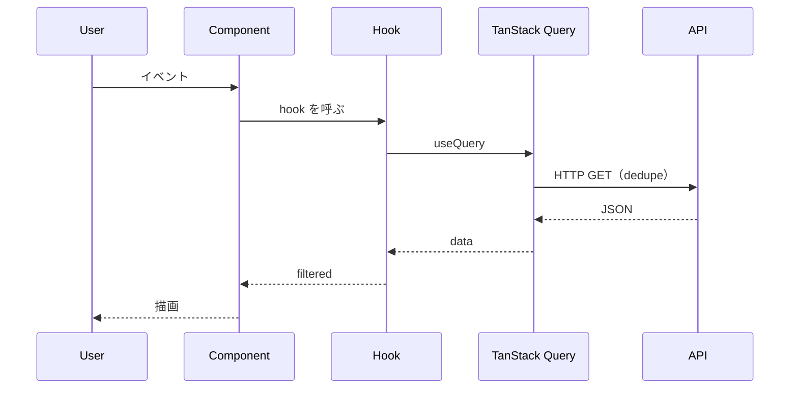
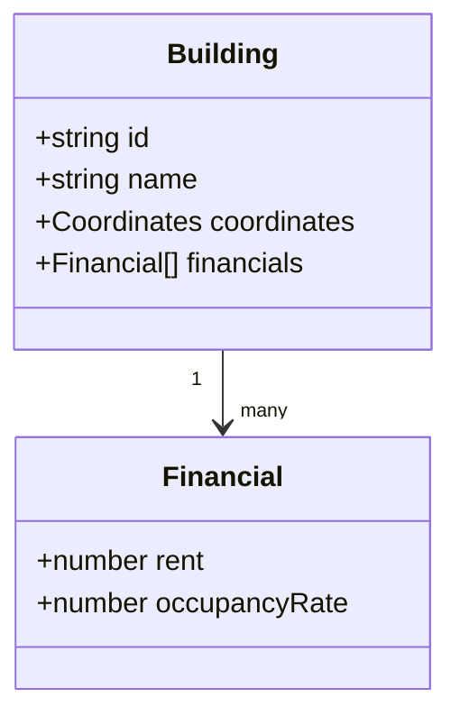
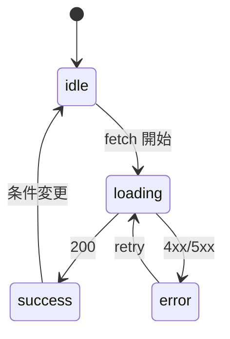
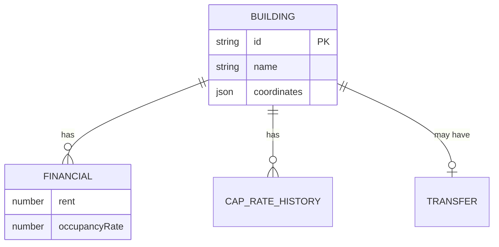

# Mermaid Patterns

よく使う図のテンプレ集。コピペして書き換える。

## データフロー（flowchart）

UI からデータ層までの流れ。横方向 (LR) が読みやすい。

````mdx
```mermaid
flowchart LR
    User[ユーザー] --> Search[検索フォーム]
    Search --> Filter[useFilteredBuildings]
    Filter --> Query[useBuildings + TanStack Query]
    Query --> API[/api/v1/buildings]
    Filter --> List[SearchResultList]
    Filter --> Map[MapView]
```
````

## API シーケンス（sequenceDiagram）

複数 actor をまたぐ非同期処理。

````mdx

````

## ドメインモデル（classDiagram）

型 / インターフェースの関係。

````mdx

````

## 状態遷移（stateDiagram-v2）

UI の状態遷移を可視化。

````mdx

````

## アーキテクチャ（subgraph）

レイヤ分割を表現。

````mdx
```mermaid
flowchart TB
    subgraph UI[UI Layer]
        Page[page.tsx]
        List[SearchResultList]
        Map[MapView]
    end
    subgraph Hooks[Hooks]
        UseFiltered[useFilteredBuildings]
        UseBuildings[useBuildings]
    end
    subgraph Data[Data]
        QC[QueryClient]
        API[/api/v1/buildings]
    end
    Page --> List
    Page --> Map
    List --> UseFiltered
    Map --> UseFiltered
    UseFiltered --> UseBuildings
    UseBuildings --> QC
    QC --> API
```
````

## ER（erDiagram）

DB / JSON スキーマの関係。

````mdx

````

## 注意

- `flowchart` ノードラベルに半角カッコを含めると parse 失敗する → 全角 `（）` or `\(` でエスケープ
- 日本語ラベルは `["..."]` で囲むと安全
- 長文ラベルは改行 `<br/>` を使う
