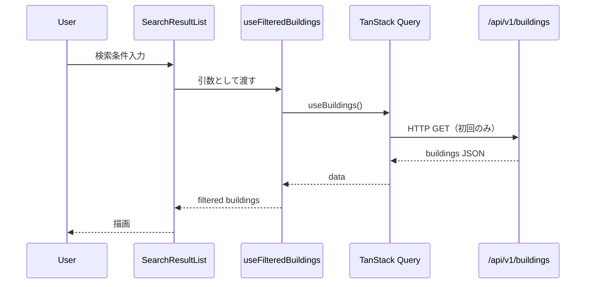
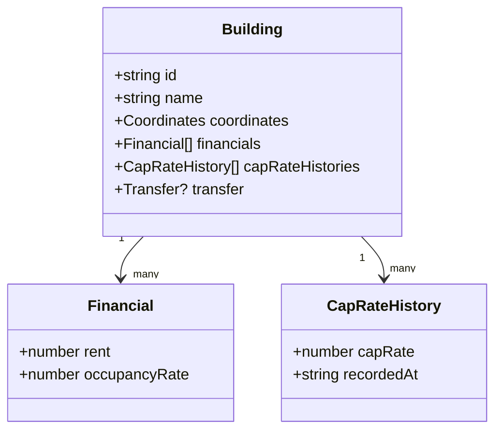
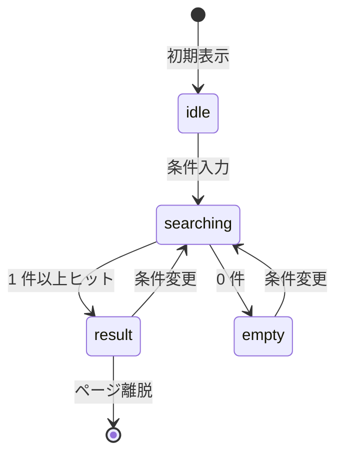

`astro-mermaid` integration によって、` ```mermaid ` の code block が自動で SVG に描画される。

## Flowchart

```mermaid
flowchart LR
    User[ユーザー] --> Search[検索フォーム]
    Search --> Filter[useFilteredBuildings]
    Filter --> Query[useBuildings + TanStack Query]
    Query --> API[/api/v1/buildings]
    Filter --> List[SearchResultList]
    Filter --> Map[MapView]
```

## Sequence



## Class



## State


