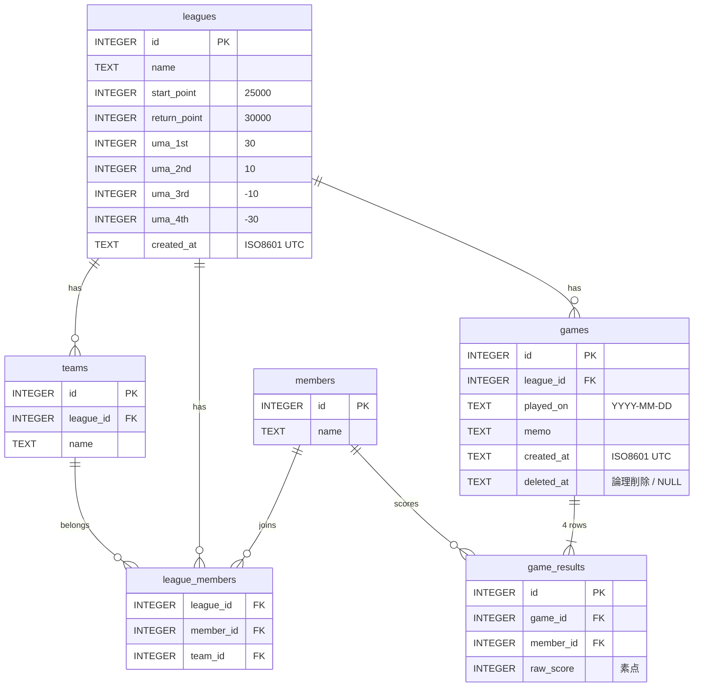

import { Aside } from '@astrojs/starlight/components';

## 構造

**リーグ > 半荘（日付付き） > 4人の結果**。「節」テーブルは作らない。



## テーブル説明

| テーブル | 役割 | 誰が書く |
|---|---|---|
| `leagues` | リーグ（シーズン）と換算ルール設定 | 運営がSQL直（wrangler） |
| `teams` | リーグ内のチーム（2つ） | 運営がSQL直（wrangler） |
| `members` | 人のマスタ（リーグ横断） | 運営がSQL直（wrangler） |
| `league_members` | 誰がどのリーグのどのチームか | 運営がSQL直（wrangler） |
| `games` | 半荘。日付・メモ・論理削除フラグ | **アプリ（入力係）** |
| `game_results` | 半荘ごとの4人の素点 | **アプリ（入力係）** |

## Postgres からの型の読み替え

SQLite の型は `INTEGER` / `REAL` / `TEXT` / `BLOB` の4つだけ。Supabase 版から次のように置き換える。

| Supabase (Postgres) | SQLite | 補足 |
|---|---|---|
| `uuid` | `INTEGER PRIMARY KEY` | rowid のエイリアスで最速。**手でSQLを打つ運用なので短いIDの方が実用的** |
| `timestamptz` | `TEXT`（ISO8601, UTC） | `DEFAULT (strftime('%Y-%m-%dT%H:%M:%SZ','now'))` |
| `date` | `TEXT`（`YYYY-MM-DD`） | SQLite の日付関数がそのまま使える形式 |
| `int` | `INTEGER` | 同じ |
| `text` | `TEXT` | 同じ |
| `boolean` | （使わない） | 論理削除は `deleted_at` の NULL 判定で表現 |

<Aside type="note" title="ID を uuid から INTEGER に変えた理由">
管理UIを作らず `wrangler d1 execute` でSQLを直接打ってデータを入れる方針（決定#11）だと、uuid は手打ちが現実的に無理。`INTEGER PRIMARY KEY` なら `seed.sql` が人間に読める形になり、URLも `/games/12` と短くなる。10人規模でID衝突の心配もない。
</Aside>

## スキーマ

```sql title="migrations/0001_init.sql"
CREATE TABLE leagues (
  id           INTEGER PRIMARY KEY,
  name         TEXT    NOT NULL,
  start_point  INTEGER NOT NULL DEFAULT 25000,
  return_point INTEGER NOT NULL DEFAULT 30000,
  uma_1st      INTEGER NOT NULL DEFAULT  30,
  uma_2nd      INTEGER NOT NULL DEFAULT  10,
  uma_3rd      INTEGER NOT NULL DEFAULT -10,
  uma_4th      INTEGER NOT NULL DEFAULT -30,
  created_at   TEXT    NOT NULL DEFAULT (strftime('%Y-%m-%dT%H:%M:%SZ','now'))
) STRICT;

CREATE TABLE members (
  id   INTEGER PRIMARY KEY,
  name TEXT NOT NULL
) STRICT;

CREATE TABLE teams (
  id        INTEGER PRIMARY KEY,
  league_id INTEGER NOT NULL REFERENCES leagues(id),
  name      TEXT    NOT NULL
) STRICT;

CREATE TABLE league_members (
  league_id INTEGER NOT NULL REFERENCES leagues(id),
  member_id INTEGER NOT NULL REFERENCES members(id),
  team_id   INTEGER NOT NULL REFERENCES teams(id),
  PRIMARY KEY (league_id, member_id)
) STRICT;

CREATE TABLE games (
  id         INTEGER PRIMARY KEY,
  league_id  INTEGER NOT NULL REFERENCES leagues(id),
  played_on  TEXT    NOT NULL,
  memo       TEXT,
  created_at TEXT    NOT NULL DEFAULT (strftime('%Y-%m-%dT%H:%M:%SZ','now')),
  deleted_at TEXT
) STRICT;

CREATE TABLE game_results (
  id        INTEGER PRIMARY KEY,
  game_id   INTEGER NOT NULL REFERENCES games(id),
  member_id INTEGER NOT NULL REFERENCES members(id),
  raw_score INTEGER NOT NULL CHECK (raw_score % 100 = 0),
  UNIQUE (game_id, member_id)
) STRICT;

CREATE INDEX idx_games_league_played  ON games(league_id, played_on);
CREATE INDEX idx_results_game         ON game_results(game_id);
CREATE INDEX idx_results_member       ON game_results(member_id);
```

<Aside type="tip" title="STRICT を付ける">
SQLite は既定だと `INTEGER` カラムに文字列を入れても通ってしまう。`STRICT` を付けると型が強制されるので、Postgres 相当の安心感が得られる。付けない理由がない。
</Aside>

## 制約・ルール

- `game_results` は 1 `game` につき必ず 4 行（**APIサーバー側で保証**。DBは `UNIQUE(game_id, member_id)`）
- `raw_score` は 100 の倍数、負数可（`CHECK (raw_score % 100 = 0)`）
- 素点合計 = `start_point × 4`、2-2 固定は **APIサーバー側でバリデーション**（DBトリガーにはしない。シンプル優先）
- 削除は `games.deleted_at` をセット。取得時は `deleted_at IS NULL` で絞る
- オカは `(return_point − start_point) × 4 / 1000` で導出できるので**カラムにしない**
- 外部キーは D1 では**既定で常に強制**される。旧構成で必要だった `PRAGMA foreign_keys = ON` は不要（→ [技術スタック](/spec/tech-stack/)）

<Aside type="note" title="pt/順位はDBに持たない">
`game_results` に pt や rank のカラムは置かない。フロントで `leagues` の設定値から都度計算する。ルール変更時に過去分を再計算する手間がゼロになる。
</Aside>

## 書き込みの原子性

半荘の登録は `games` 1行 + `game_results` 4行の**セットで初めて意味を持つ**。途中で落ちると3人分だけの壊れた半荘が残るので、必ず1トランザクションにまとめる。

D1 には対話的トランザクション（`BEGIN`〜`COMMIT`）が無く、原子化の手段は **`batch()`** だけ。渡した全文が1トランザクションとして実行され、1文でも失敗すれば**全体がロールバック**される。

```ts title="server/routes/games.ts"
const db = c.env.DB;
await db.batch([
  db.prepare('INSERT INTO games (league_id, played_on, memo) VALUES (?1, ?2, ?3)')
    .bind(input.leagueId, input.playedOn, input.memo ?? null),
  ...input.results.map((r) =>
    db.prepare(
      // batch 全体が1トランザクション＝他の書き込みは割り込めないので、
      // 直前に INSERT した半荘の id を MAX(id) で安全に参照できる
      'INSERT INTO game_results (game_id, member_id, raw_score) VALUES ((SELECT MAX(id) FROM games), ?1, ?2)'
    ).bind(r.memberId, r.rawScore)
  ),
]);
```

<Aside type="caution" title="last_insert_rowid() は使わない">
`last_insert_rowid()` は「直前のINSERT」の rowid を返すので、2件目以降の `game_results` INSERT では **1件目の game_results の id** を返してしまう。`(SELECT MAX(id) FROM games)` なら全行から見て同じ値になる。バリデーションもRLSも無い点は旧構成と同じで、整合性はすべてAPI層の責任。
</Aside>

## アクセス制御（旧: RLS）

RLS は無くなったので、APIサーバーのミドルウェアで代替する。

| メソッド | 対象 | 制御 |
|---|---|---|
| `GET /api/**` | 閲覧全般 | **誰でも可**（認証なし） |
| `POST /api/games`<br/>`PATCH /api/games/:id`<br/>`PATCH /api/games/:id/deleted` | 半荘の登録・修正（全置換）・論理削除 | **`X-Passcode` ヘッダが `WRITE_PASSCODE` と一致した時だけ通す**（→ [APIの形](/spec/features/#apiの形)） |
| `DELETE` | – | **エンドポイントを作らない**（論理削除のみ。事故防止） |
| 運営系テーブル | `leagues` `teams` `members` `league_members` | **書き込みAPIを作らない**。`wrangler d1 execute` でのSQL直操作のみ |

```ts title="server/auth.ts"
export const requirePasscode: MiddlewareHandler<{ Bindings: Bindings }> = async (c, next) => {
  if (c.req.header('X-Passcode') !== c.env.WRITE_PASSCODE) {
    return c.json({ error: 'invalid passcode' }, 401);
  }
  await next();
};
```

## マイグレーション

- `migrations/` に連番SQLを置き、`wrangler d1 migrations apply` が未適用分を順に流す（適用履歴は D1 が `d1_migrations` テーブルで管理）
- 旧構成の自前ランナー（`db/migrate.ts` + `PRAGMA user_version`）は**不要になった**
- 型は生成せず、`src/lib/types.ts` に**手書き**する（テーブル7個・カラム30個弱なので生成ツールに見合わない）
- 初期データ（メンバー10人・リーグ・チーム・所属）は `db/seed.sql`

```bash
wrangler d1 migrations create majan init     # migrations/0001_init.sql の雛形が作られる
wrangler d1 migrations apply majan --local   # ローカル（.wrangler/state/ 配下）に適用
wrangler d1 migrations apply majan --remote  # 本番に適用
```

<Aside type="caution" title="SQLite の ALTER TABLE は弱い">
SQLite は `ALTER TABLE ... ADD COLUMN` と `RENAME` しかできない。**カラムの型変更・制約追加・削除ができない**ので、後からスキーマを変えるときは「新テーブル作成 → `INSERT INTO ... SELECT` → 旧テーブル DROP → RENAME」の手順を踏む。Postgres より migration のコストが高いので、初回のスキーマは慎重に決める。
</Aside>

## バックアップ

一次防衛は D1 の **Time Travel**。毎分自動でスナップショットが取られ、無料枠でも**過去7日の任意の時点**に復元できる（決定#17）。

```bash
# 復元可能な範囲を確認
wrangler d1 time-travel info majan

# 指定時刻の状態に巻き戻す
wrangler d1 time-travel restore majan --timestamp=2026-08-25T13:00:00Z
```

7日より古い状態も残したい分は、定期的にSQLダンプを手元へ落とす。

```bash
wrangler d1 export majan --remote --output=./backups/majan-2026-08-26.sql
```

<Aside type="note" title="ダンプはただのSQLテキスト">
`export` の出力は `CREATE TABLE` + `INSERT` の羅列なので、ローカルの `sqlite3` に流せば**本番同等のDBファイルを手元で再現**できる。旧構成の「ファイル1個をコピーする」感覚は、この形で残る。WAL破損を気にした `sqlite3 .backup` の儀式は不要になった。
</Aside>
