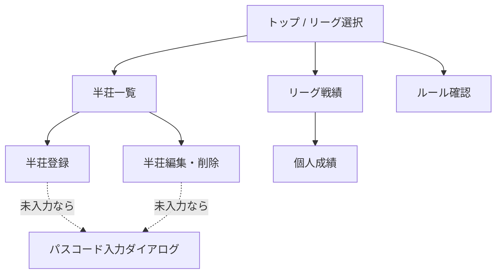

import { Aside, Steps } from '@astrojs/starlight/components';

## 画面一覧



| 画面 | 内容 | 書き込み |
|---|---|---|
| トップ | リーグ選択（1つならそのまま戦績へ） | – |
| リーグ戦績 | チーム合計pt、個人ランキング、累計pt推移グラフ | – |
| 半荘一覧 | 日付順の半荘リスト。各半荘の4人・素点・pt・順位 | – |
| 半荘登録 | 日付・4人・素点を入力して保存 | **唯一の新規登録**／パスコード必要 |
| 半荘編集・削除 | 登録済みの修正、論理削除（確認ダイアログ） | 更新／パスコード必要 |
| 個人成績 | 指標一覧＋推移グラフ | – |
| ルール確認 | 対局ルール（Markdown）＋換算設定 | – |
| パスコード入力 | 書き込み時にだけ出るダイアログ。`localStorage` に保存 | – |

<Aside type="note" title="閲覧は無認証のまま">
`GET` 系はパスコード不要。10人全員がURLを開くだけで戦績を見られる。パスコードが要るのは登録・編集・削除だけ（決定#16）。
</Aside>

## 半荘登録（コア機能）

### 入力項目

- 日付（デフォルト今日）
- 4人のメンバー（リーグ所属メンバーから選択）
- 各人の素点（100点単位、負数可）

### バリデーション

| チェック | 条件 | 理由 |
|---|---|---|
| メンバー重複なし | 4人がすべて異なる | – |
| **2-2固定** | 各チームからちょうど2人ずつ | チーム戦の公平性 |
| 素点合計 | 4人合計 = **`start_point × 4`**（デフォルト設定なら 25,000 × 4 = 100,000） | 供託リーチ棒はトップ取りで精算済み前提。**`100000` を定数で埋め込まない**（リーグ設定依存） |
| 素点の単位 | 100の倍数 | 誤入力防止 |
| 箱下 | 負数OK | トビ終了なし・箱下精算あり |

<Aside type="caution" title="バリデーションはフロントとAPIの両方に置く">
Supabase 直アクセス時代は「アプリ側でバリデーション」の1箇所で済んだが、API層ができた以上 **同じチェックをサーバーでも通す**。フロントのチェックは入力体験のため、サーバーのチェックはデータ整合性のため、と役割が違う。共通ロジックを `src/lib/scoring.ts` 側に置いて両方から呼ぶのが安い。
</Aside>

<Aside type="tip">
保存するのは素点だけ。順位・pt はフロントで都度計算するので、登録画面でもプレビューとして計算結果を表示すると誤入力に気づきやすい。
</Aside>

### 登録の流れ

<Steps>
1. 半荘一覧 →「登録」ボタン
2. 日付を確認（デフォルト今日）
3. 4人を選択（チーム別に色分け表示、2-2でないと警告）
4. 素点を入力 → 合計が100,000になると保存ボタンが有効化
5. pt/順位のプレビューを確認して保存
6. パスコード未入力ならダイアログが出る（一度入れれば `localStorage` に残る）
</Steps>

## リーグ戦績

- **チーム合計pt** = 所属メンバーの pt 総和（半荘数の上限なし）
- **個人ランキング** = 合計pt 降順
- **累計pt推移グラフ**（Recharts の折れ線）: 横軸＝半荘の通し番号 or 日付、縦軸＝累計pt。チーム・個人を切替

<Aside type="note" title="取得は1リクエストにまとめる">
`GET /api/leagues/:id` で **リーグ設定・メンバー・チーム・全半荘の素点** を1回で返す。SQLite なので JOIN の回数を気にする必要はなく、往復回数を減らすほうが効く。以降の集計は全部フロントで行う（決定#14）。
</Aside>

## 個人成績

素点だけから算出できる指標に絞る。

| 指標 | 算出 |
|---|---|
| 合計pt | Σ pt |
| 半荘数 | 出場した半荘の数 |
| 平均pt | 合計pt / 半荘数 |
| 平均順位 | Σ 順位 / 半荘数（同点は平均順位、例: 2位タイ→2.5） |
| 1〜4着回数・率 | 各順位のカウント / 半荘数 |
| トップ率 / ラス率 | 1着率 / 4着率 |
| 最高・最低素点 | max / min(raw_score) |
| 累計pt推移 | 折れ線グラフ |

## 修正・削除

- **入力係のみ**が編集・削除できる（`X-Passcode` ヘッダ必須）
- 削除は物理削除ではなく `games.deleted_at` をセットする**論理削除**
- `DELETE` エンドポイントは実装しない
- 削除済みは一覧・集計から除外。復旧が必要になったら運営が DB で `deleted_at` を NULL に戻す

### APIの形

書き込み系エンドポイントは**3本だけ**。すべて `X-Passcode` 必須。

| メソッド | パス | 意味 |
|---|---|---|
| `POST` | `/api/games` | 半荘の新規登録（`games` 1行 + `game_results` 4行） |
| `PATCH` | `/api/games/:id` | 半荘の内容修正（**全置換**） |
| `PATCH` | `/api/games/:id/deleted` | 論理削除 |

<Aside type="caution" title="PATCH /api/games/:id は部分更新ではなく全置換">
`played_on` / `memo` / `results`（4人分）を**まとめて丸ごと差し替える**。部分更新（素点1人分だけ送る等）は受け付けない。

理由は2つ。(a) 登録時とまったく同じバリデーション（2-2固定・合計 `start_point × 4`・重複なし・4行揃っている）をそのまま再利用できる。(b) メンバーの差し替えが起きたとき、`game_results` を行単位で `UPDATE` すると `UNIQUE(game_id, member_id)` と衝突しうるし「常に4行」の保証も崩れる。

DB操作は `batch()` の中で **該当 `game_id` の `game_results` を全削除 → 4行 INSERT** の順に流す。`batch()` 全体が1トランザクションなので、途中で落ちても4行が欠けた状態は残らない。
</Aside>

```jsonc
// PATCH /api/games/12  リクエストボディ（POST /api/games と results 以外同型）
{
  "playedOn": "2026-08-26",
  "memo": null,
  "results": [
    { "memberId": 1, "rawScore": 42300 },
    { "memberId": 6, "rawScore": 28100 },
    { "memberId": 2, "rawScore": 18400 },
    { "memberId": 7, "rawScore": 11200 }
  ]
}
```

| 状況 | レスポンス |
|---|---|
| 成功 | `200` |
| パスコード不一致 | `401` |
| バリデーション違反 | `400`（どのチェックに落ちたかを `error` に入れる） |
| `id` が存在しない | `404` |
| **`deleted_at` が入っている半荘** | `404`（削除済みは編集させない。戻すのは運営のSQL） |

### 論理削除

```jsonc
// PATCH /api/games/12/deleted
{ "deleted": true }
```

`deleted: false`（復活）は **受け付けない**（`400`）。復旧は運営が `wrangler d1 execute` で `deleted_at = NULL` に戻す運用のまま（決定#11・#9）。アプリ側に復活UIを作ると「削除の確認ダイアログ」の意味が薄れるので、あえて片道にしている。

## ルール確認ページ

- 対局ルールはリポジトリ内の Markdown（変更は PR → 再デプロイ）
- ポイント換算部分（持ち点・返し点・ウマ・オカ）だけは DB の `leagues` 設定値から動的に差し込む
- 内容は [対局ルール](/spec/rules/) を参照

## 作らないもの

- ログイン画面・ユーザーアカウント（書き込みは**共通パスコード1本**のみ）
- 誰が入力したかの記録（入力係が1人なので不要）
- メンバー・リーグ・チーム・ルール設定の管理画面（→ [使い方](/spec/usage/) の DB ファイル直操作）
- 局単位の記録（和了率・放銃率など）
- チップ・ペナルティの入力
