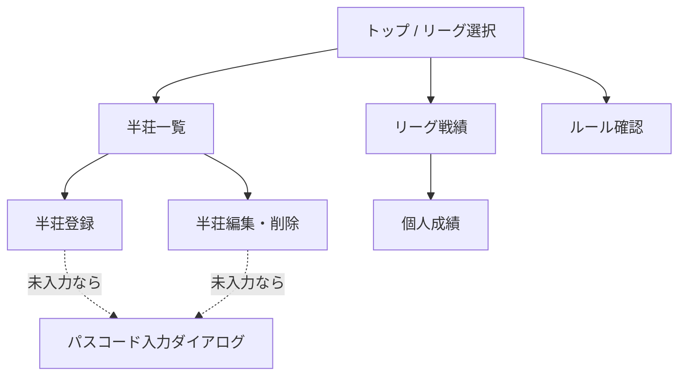

import { Aside, Steps } from '@astrojs/starlight/components';

## 画面一覧



| 画面 | 内容 | 書き込み |
|---|---|---|
| トップ | リーグ選択（`GET /api/leagues` の結果が**1件ならそのリーグの戦績へリダイレクト**、複数なら選択させる） | – |
| リーグ戦績 | チーム合計pt、個人ランキング、累計pt推移グラフ | – |
| 半荘一覧 | **上に「予定」（予約）**、下に確定済みを日付順。各半荘の4人・素点・pt・順位 | – |
| 半荘登録 | 日付・4人・素点を入力して保存。**素点を空にすれば「予約」として登録**できる | **唯一の新規登録**／パスコード必要 |
| 半荘編集・削除 | 登録済みの修正、論理削除（確認ダイアログ） | 更新／パスコード必要 |
| 個人成績 | 指標一覧＋推移グラフ | – |
| ルール確認 | 対局ルール（TSX に直書き）＋換算設定（DBから） | – |
| パスコード入力 | 書き込み時にだけ出るダイアログ。`localStorage` に保存 | – |
| **運営メニュー** | `/leagues/:id/admin`。リーグ名・チーム名・名簿を編集して**その場で反映する**。**ナビには出さない** | `POST /api/leagues/:id/roster` |

<Aside type="note" title="閲覧は無認証のまま">
`GET` 系はパスコード不要。10人全員がURLを開くだけで戦績を見られる。パスコードが要るのは登録・編集・削除だけ（決定#16）。
</Aside>

## 半荘登録（コア機能）

### 入力項目

- **タイトル**（省略可。例:「第3節」「月例会」）
- 日付（デフォルト今日 → 下記の注意）
- 4人のメンバー（リーグ所属メンバーから選択）
- 各人の素点（100点単位、**負数可** → 下記の注意）

<Aside type="danger" title="「今日」を toISOString() で作らない — JST では毎日9時間ずれる">
`new Date().toISOString().slice(0, 10)` は **UTC の日付**を返す。JST は UTC+9 なので、**日本時間の 00:00〜08:59 はすべて前日になる**。

```
JST 2026-08-26 01:30 → toISOString() は 2026-08-25   ずれる
JST 2026-08-26 08:30 → toISOString() は 2026-08-25   ずれる
JST 2026-08-27 00:10 → toISOString() は 2026-08-26   ずれる
```

麻雀は夜遅くまでやるうえ、**入力係が翌朝まとめて入力する**こともある。エッジケースではなく**1日のうち9時間**が該当する。

ローカル日付を使うこと。

```ts
const d = new Date();
const today = `${d.getFullYear()}-${String(d.getMonth() + 1).padStart(2, "0")}-${String(d.getDate()).padStart(2, "0")}`;
// もしくは new Intl.DateTimeFormat("sv-SE").format(d)（sv-SE は YYYY-MM-DD 形式）
```

日付は**入力係が確認して変えられる**（デフォルトが今日というだけ）ので、ずれても直せる。ただし**気づかなければ直らない**ので、既定値を正しくしておく。
</Aside>

<Aside type="caution" title="箱下（マイナスの素点）を入力できること">
仕様は「素点は負数OK（トビ終了なし・箱下精算あり）」。**モバイルで負数を入力する手段が要る。**

`inputMode="numeric"` はテンキーだけを出すので、**多くの端末で「−」が打てない**。`inputMode="decimal"` も同様。素点入力欄をこれらにすると、**箱下の半荘が登録できなくなる**。

対処はいくつかある（どれを採るかは実装判断）。
- `inputMode="text"` にしてソフトキーボードを制限しない
- プラス／マイナスを切り替えるトグルを添える
- `type="number"`（端末により挙動が異なるので要実機確認）

**実機（スマホ）でマイナスが入力できることを確認すること。** PC のブラウザだけで確認すると見落とす。
</Aside>

### バリデーション

| チェック | 条件 | 理由 |
|---|---|---|
| 件数 | ちょうど4人 | – |
| メンバー重複なし | 4人がすべて異なる | – |
| メンバーIDの範囲 | `Number.isSafeInteger()` かつ正 | – |
| **リーグ所属** | 4人とも `league_members` にその `league_id` で載っている | **外部キーでは防げない**（下記） |
| **2-2固定** | **4人がちょうど2チームにまたがり、各チーム2人ずつ** | チーム戦の公平性。3チーム以上にまたがる編成は弾く（DBは2チーム固定を強制していない）。**エラーは「どのチームが何人か」を示す**（4人全員の名前を並べても直しようがない） |
| 素点合計 | 4人合計 = **`start_point × 4`**（デフォルト設定なら 25,000 × 4 = 100,000） | 供託リーチ棒はトップ取りで精算済み前提。**`100000` を定数で埋め込まない**（リーグ設定依存） |
| 素点の単位 | 100の倍数 | 誤入力防止 |
| 素点の範囲 | **`Number.isSafeInteger()`** | 2^53 を超えると `% 100` の判定が嘘になり**ゼロサムが壊れる**（→ [ゼロサムが成立する条件](/spec/scoring/#ゼロサムが成立する条件)） |
| 箱下 | 負数OK | トビ終了なし・箱下精算あり |
| 日付 | `YYYY-MM-DD` の実在日付 | DB側の `CHECK` でも二重に守る（→ [日付の検証](/spec/data-model/#日付の検証)） |
| タイトル | **60文字以内（省略可）** | 一覧で**一番大きく出る行**なので長いとレイアウトが崩れる。`GET /api/leagues/:id` が全半荘を1回で返す設計でもあり、1件の肥大が全員の取得を重くする |

<Aside type="caution" title="「リーグ所属」チェックはAPIにしか置けない">
`game_results.member_id` の外部キーは **`members(id)` が存在するか**しか見ない。`league_members` にそのリーグで載っているかは検査されないので、**別リーグのメンバーや、リーグに未所属のメンバーを含む半荘が DB に入ってしまう**（実測確認済み）。

2-2固定チェックはどのみち `league_members` を引いてチームを判定するので、**そのついでに「4人とも引けたか」を確認すれば所属チェックになる**。引けなかった人が1人でもいたら弾く。

引くときは必ず **`WHERE league_id = ?`** でスコープすること。`member_id` だけで引くと別リーグの所属行が混ざる。

**副作用**: メンバーがリーグから外れた後、その人を含む過去の半荘は `PATCH` できなくなる（所属チェックで落ちる）。10人固定なら滅多に起きないが、起きたときは**運営が `wrangler d1 execute` で直す**（決定#11と同じ扱い）。編集画面には「このメンバーは現在リーグに所属していません」と出す。チェックを緩める方向では直さない。
</Aside>

<Aside type="note" title="派生エラーは抑制する — 原因を隠さないために">
検証は表の順（件数 → 重複 → 所属 → 2-2 → 合計 → 単位 → 日付）に行い、**エラーは全部まとめて返す**（最初の1件で打ち切らない）。

ただし **2-2 と素点合計だけは、前提が崩れているときに判定しない**。

| 前提の崩れ | 抑制するもの | 抑制しないと何が起きるか |
|---|---|---|
| 4人でない | 2-2 / 素点合計 | 3人で「各チーム2人ずつ」を問うのは無意味 |
| 重複がある | 2-2 | `A(t1), A(t1), B(t1), C(t2)` が `t1:3 / t2:1` になり、**根本原因が重複なのに「チーム構成エラー」が出る** |
| 未所属がいる | 2-2 | teamId 不明の人を数えると `undefined` チームが生まれ、**本当の原因（未所属）が「チーム構成エラー」に化ける** |

抑制するのは 2-2 と素点合計の判定だけで、**件数・重複・所属のエラーはそれぞれ独立に返す**。入力係に「2-2にしてるのになぜ？」と思わせないための措置。原因が分からないエラーは、出ないのと大差ない。
</Aside>

<Aside type="caution" title="形の検査と業務ルールの検査は2段に分ける">
`validateGameInput()` は **型どおりの `GameInput` が来る前提**で書かれている。`results` が配列でなければ `.length` で例外になるし、`playedOn` が文字列でなければ正規表現が `"undefined"` を評価してしまう。

APIは JSON ボディという**信用できない入力**を受け取るので、**形の検査を業務ルールの検査より先に置く**。

| 段 | 何を見るか | 失敗時 |
|---|---|---|
| 0. 入口 | `Content-Length` が 16KB 以下か | `413` |
| 0. 入口 | JSON としてパースできるか | `400`（`{ error: 'invalid json' }`） |
| 1. 形（parse） | `results` は配列か / `memberId` が **`typeof === 'number'` かつ `Number.isSafeInteger()`** か / **`rawScore` が同条件 または `null`（予約）** か / `playedOn` は文字列か / `title` は文字列か null か | `400`（`{ error: "..." }`） |
| 2. 業務ルール | `validateGameInput()` | `400`（**`{ errors: ValidationError[] }`**） |

フロントはフォームの型が保証されているので1段目は不要。**APIだけが2段必要**。

`Content-Type` は検査しない。同一オリジンの自前フロントしか叩かないので YAGNI。

**2種類の 400 はキー名で判別する。**

| 種類 | ボディ |
|---|---|
| 形の不正・その他のエラー | `{ "error": "..." }` |
| 業務ルール違反 | `{ "errors": [ ... ] }` |

`errors`（複数形）があれば `ValidationError[]`、`error`（単数形）なら文字列メッセージ。**`Array.isArray` で分岐しない**（レスポンスが裸の配列だと将来メタ情報を足せないため、どちらもオブジェクトで包む）。
</Aside>

<Aside type="danger" title="数値は typeof で見る。% や比較に頼ると素通りする">
`rawScore` を「100の倍数か」で見るとき、**JS の暗黙変換が防衛線を全部無効にする**。実測した値:

| 送られてきた値 | `% 100` | 結果 |
|---|---|---|
| `"25000"`（文字列） | `0` | **通る** |
| `"2.5e4"`（指数表記） | `0` | **通る** |
| `"0x61a8"`（16進） | `0` | **通る** |
| `" 25000 "`（前後空白） | `0` | **通る** |
| `null` | `0` | **通る** |

`null % 100` が `0` になるのが特に危ない。合計チェックも文字列が混ざると `'0' + '25000' + ...` の連結になり、判定の意味が変わる。

**parse 段で `typeof x === 'number' && Number.isSafeInteger(x)` を `memberId` と `rawScore` の両方に要求する。** ここを緩くすると、その先の型はすべて嘘になる。DB の `STRICT` も助けにならない（数値解釈できる TEXT は無損失変換されて格納されるため → [データモデル](/spec/data-model/#postgres-からの型の読み替え)）。
</Aside>

<Aside type="caution" title="バリデーションはフロントとAPIの両方に置く">
Supabase 直アクセス時代は「アプリ側でバリデーション」の1箇所で済んだが、API層ができた以上 **同じチェックをサーバーでも通す**。フロントのチェックは入力体験のため、サーバーのチェックはデータ整合性のため、と役割が違う。共通ロジックは **`src/lib/validation.ts`** に置いて両方から呼ぶ。

`scoring.ts` の `scoreGame()` には**入力検証を入れない**。「与えられた4人を採点する」だけの責務に保ち、業務ルールの検証は `validation.ts` に集約する。例外は**関数の事前条件**（`results` がちょうど4件か）だけで、これは違反すると*例外を投げずに妥当そうな誤った pt を返す*ため `scoreGame()` 自身が `RangeError` を投げる。
</Aside>

<Aside type="caution" title="保存できない理由を常に見せる">
保存ボタンを無効化するなら、**なぜ無効なのかが同時に見えていること**。「押せないボタン」だけを見せると、入力係は何を直せばいいか分からない。

`validateGameInput()` は**エラーを全部返す**（最初の1件で打ち切らない）ので、それをそのまま表示する。`memberIds` を使って該当メンバーの入力欄をハイライトする。

派生エラーの抑制（→ [派生エラーは抑制する](#派生エラーは抑制する--原因を隠さないために)）が効いているので、表示されるのは**本当の原因だけ**になる。
</Aside>

<Aside type="tip">
保存するのは素点だけ。順位・pt はフロントで都度計算するので、登録画面でもプレビューとして計算結果を表示すると誤入力に気づきやすい。
</Aside>

### 登録の流れ

<Steps>
1. 半荘一覧 →「登録」ボタン
2. 日付を確認（デフォルト今日）
3. 4人を選択（**チーム別に分けて表示**。どちらのチームの人か選ぶ前に分かること。2-2でないと警告）
4. 素点を入力 → **バリデーションを通ると保存ボタンが有効化**（合計だけでなく8項目すべて）
5. pt/順位のプレビューを確認して保存
6. パスコード未入力ならダイアログが出る（一度入れれば `localStorage` に残る）
</Steps>

<Aside type="danger" title="4人ぶん揃っていない半荘で画面全体を失わないこと">
`scoreGame()` は `results` が4件でないと **`RangeError` を投げる**（T2 の事前条件。黙って誤った pt を返すより良いという判断）。

これはライブラリとしては正しいが、**画面が受け止めないと1件の壊れたデータで全員が画面を失う**。

APIを通れば4件は保証される。しかし **`games` / `game_results` は運営が `wrangler d1 execute` で直接触れる**（決定#11）。`game_results` を1行消す、`games` に手で行を足す、といった操作で4件でない半荘は作れる。**そのとき閲覧者10人全員の一覧と戦績が消える。**

**壊れた半荘は「除外して他を表示」+「壊れていることを見せる」。**

| 場所 | 扱い |
|---|---|
| 半荘一覧 | その行だけ「データ不整合（運営に連絡してください）」と表示。**他の半荘は通常どおり出す** |
| `computeStats` | 集計から**除外**し、壊れた半荘のIDを返す（`unassigned` と同じ考え方） |
| 戦績画面 | 除外した半荘があれば警告を出す。**黙って集計から落とさない** |

`scoreGame` の `throw` は**そのまま残す**。呼び出す前に件数を確認するのは呼び出し側の責任で、事前条件を緩めると「黙って誤った pt を返す」に逆戻りする。
</Aside>

## リーグ戦績

- **チーム合計pt** = 所属メンバーの pt 総和（半荘数の上限なし）
- **個人ランキング** = 合計pt 降順
- **累計pt推移グラフ**（Recharts の折れ線）: 横軸＝半荘の通し番号 or 日付、縦軸＝累計pt。チーム・個人を切替

<Aside type="note" title="取得は1リクエストにまとめる">
`GET /api/leagues/:id` で **リーグ設定・メンバー・チーム・全半荘の素点** を1回で返す。SQLite なので JOIN の回数を気にする必要はなく、往復回数を減らすほうが効く。以降の集計は全部フロントで行う（決定#14）。
</Aside>

## 個人成績

素点だけから算出できる指標に絞る。

| 指標 | 算出 | 半荘数が 0 のとき |
|---|---|---|
| 合計pt | Σ pt | `0` |
| 半荘数 | 出場した半荘の数 | `0` |
| 平均pt | 合計pt / 半荘数 | **`null`** |
| 平均順位 | Σ **占める順位** / 半荘数（下記） | **`null`** |
| 1〜4着回数 | `rank` のカウント（同点は全員がその着） | すべて `0` |
| 1〜4着率 | 各着回数 / 半荘数 | **`null`** |
| トップ率 / ラス率 | 1着率 / 4着率 | **`null`** |
| 最高・最低素点 | max / min(raw_score) | **`null`** |
| 累計pt推移 | 折れ線グラフ | 空 |

ランキングの並びは **合計pt 降順 → 未出場者（半荘数0）は末尾 → 同値は `memberId` 昇順**。`null` を含む配列を素朴に `b.x - a.x` でソートすると `null` が `0` として扱われ、**未出場者が中位に紛れ込む**。

<Aside type="caution" title="半荘数 0 のメンバーは必ず存在する — NaN を返さないこと">
リーグ開始直後は**全員が半荘数 0**。その後も、その日に来なかったメンバーは 0 のままになる。

素朴に割ると `0 / 0 = NaN`、`Math.max()` は **`-Infinity`**、`Math.min()` は **`Infinity`** を返す（実測）。`NaN` はそのまま画面に「NaN」と出るうえ、比較・ソートでも伝播して**ランキング全体を壊す**。

**未定義の指標は `null` を返す**（`NaN` / `Infinity` を返さない）。UI 側は `null` を「–」と表示する。
</Aside>

<Aside type="caution" title="平均順位に scoreGame の rank をそのまま使わない">
`scoreGame` が返す `rank` は**同点グループの先頭順位**（`1,1,3,4` の形）。これを合計して割ると、同点の有無で分母と分子の整合が崩れる。実測:

| 局面 | `rank` | Σ`rank` | **占める順位** | Σ占有 |
|---|---|---|---|---|
| 同点なし | `1,2,3,4` | 10 | `1,2,3,4` | **10** |
| 2位が2人同点 | `1,2,2,4` | **9** | `1,2.5,2.5,4` | **10** |
| 3人トップ同点 | `1,1,1,4` | **7** | `2,2,2,4` | **10** |
| 全員同点 | `1,1,1,1` | **4** | `2.5,2.5,2.5,2.5` | **10** |

**Σ占める順位は常に 1+2+3+4 = 10 で安定する。** 平均順位はこちらを使う。

`Scored[]` から導出できるので `scoreGame` を変える必要はない。同じ `rank` を持つ人数を `size` とすると

```
占める順位 = rank + (size − 1) / 2
```
</Aside>

<Aside type="danger" title="集計も deci 整数で行う — pt を float で足すと同点判定が壊れる">
`Scored.pt` は `0.1` 刻みの浮動小数。**そのまま `reduce` で足すと誤差が出る。**

```
16.7 を 10回 float で加算 → 166.99999999999997
deci 整数で加算して /10   → 167
```

表示は `toFixed(1)` で隠れるが、**ランキングのソートと同点判定が壊れる**。数学的に同点の2人が `1e-14` の差で順位を分けられてしまう。

**合計pt・平均pt・累計pt はすべて deci 整数（`Math.round(pt * 10)`）で集計し、最後に `/ 10` する。** `scoring.ts` が内部を deci にしたのとまったく同じ理由（→ [丸めの扱い](/spec/scoring/#丸めの扱い)）。

**平均順位も同じ**。「占める順位 × 2」なら `.5` が消えて整数になるので、整数のまま集計して最後に `/ 2` する（`Σ占める順位 × 2 = 20 × 半荘数` で検算できる）。
</Aside>

<Aside type="note" title="着順回数は rank で数える。同点トップは全員が1着">
「トップ率」は「トップを取った（分け合った）割合」と読むのが自然なので、**同点1位は全員 1着として数える**。

この結果、**全員の着順回数を横に足すと半荘数と合わなくなる**（3人トップ同点の半荘では 1着が3人・2着と3着が0人になる）。実測で3半荘の合計が `[5,3,1,3]` になることを確認済み。

ただし**1人あたりで見れば 1着〜4着の合計は必ず半荘数と一致する**（各半荘で必ず1つの `rank` を持つため）ので、率の計算は破綻しない。横に足した数字はどこにも表示しない。
</Aside>

<Aside type="caution" title="リーグを外れたメンバーの過去の半荘 — チーム合計が釣り合わなくなる">
`league_members` から外されたメンバーでも、**その人が出た過去の半荘は `games` に残る**（決定#9 の論理削除とは別。半荘自体は生きている）。

このとき集計は次のようになる。

- **個人成績には出す。** その人の成績は実際に存在するし、画面から消えるのは不自然
- **チーム合計には入れられない。** 所属が引けないのでどちらのチームか決まらない

結果、**チーム合計ptの和が 0 にならなくなる**。実測例（4人目が名簿に無い場合）:
```
個人:  1:+62.3  2:−21.6  6:+8.1  7:0  99:−48.8   Σ = 0   ← 個人側は保たれる
チーム: A:+40.7  B:+8.1                            Σ = +48.8  ← 99 のぶんが欠ける
```

**この状態を黙って表示しない。** `computeStats` は所属の引けないメンバーを `unassigned` として**別に返す**こと。

```
Σ(チーム合計pt) + unassigned の合計pt = 0
```
が不変条件として成り立ち、`unassigned` が空でないことを画面が検知できる。T8 は「チーム合計が釣り合っている」前提で表示してよいが、`unassigned` が空でなければ警告を出す。

<br />

**運営向けの回避策のほうが本質的**: `league_members` から人を消さないこと。10人固定のリーグで誰かが抜けても、**行を残したまま単に出場しなくなるだけ**にすれば、この状態は発生しない。DBはこれを強制できない（`game_results` に `league_id` が無いので外部キーを張れない）ので、運用で守る。→ [使い方](/spec/usage/)
</Aside>

## 予約（次の対局を先に登録する）

「次に誰が対局するか」を先に登録できる。**素点を入れずに保存すれば予約**になる。

対局が終わったら、**予約を編集して素点を埋める**と確定する。新しい画面や専用のAPIは作らない。

### 予約でも守るもの・守らないもの

| チェック | 予約 | 確定 |
|---|---|---|
| 件数（ちょうど4人） | ✅ | ✅ |
| メンバー重複なし | ✅ | ✅ |
| リーグ所属 | ✅ | ✅ |
| **2-2固定** | ✅ | ✅ |
| 日付 | ✅ | ✅ |
| タイトル | ✅ | ✅ |
| 素点合計 = `start_point × 4` | – | ✅ |
| 素点の単位・範囲 | – | ✅ |

**4人は予約の時点で確定している必要がある**（「次に誰が対局するか」を示すのが目的なので、人が決まっていない予約に意味がない）。

### 素点は「全部入れる」か「全部空」のどちらか

一部だけ入っている状態は**受け付けない**（`400`）。「3人ぶん入れて保存し、あとで4人目」を許すと、その半荘は予約でも確定でもない**中途半端な状態**になり、集計に入れるかどうかが決められなくなる。

入力途中の値を保存したいという要求は、**半荘が終わってから入力する**という運用（決定#8: 入力コスト最小）と噛み合わないので作らない。

### 一覧での見せ方

<Aside type="note" title="タイトルが主、日付が従">
一覧では **タイトルを一番大きく**、日付をその下に小さく出す。タイトルが空なら**日付を大きく**出す（タイトル欄のために空行を作らない）。

```
第3節              ← タイトル（大きい）
2026-08-26        ← 日付（小さい）

2026-08-26        ← タイトルが空なら日付が大きい
```

「どの半荘か」を人が識別するとき、**日付より名前の方が手がかりになる**（同じ日に複数半荘がありうるため）。
</Aside>

**「予定」を一番上にまとめ**、その下に確定済みを日付順（新しい順）で並べる。予約は pt・順位を持たないので、**4人の名前と日付だけ**を出す。

<Aside type="note" title="予約は「まだ無い」であって「壊れている」ではない">
`computeStats` は予約を**集計から除外**するが、**警告は出さない**。4人ぶん揃っていない壊れたデータ（`broken`）とは扱いが違う。

同じ「集計に入れない」でも、**予約は正常な状態、`broken` は運営が直すべき異常**。混ぜて表示しないこと（→ [原則5](/spec/features/)：表示が事実と違うことを言わない）。
</Aside>

## 修正・削除

- **入力係のみ**が編集・削除できる（`X-Passcode` ヘッダ必須）
- 削除は物理削除ではなく `games.deleted_at` をセットする**論理削除**
- `DELETE` エンドポイントは実装しない
- 削除済みは一覧・集計から除外。復旧が必要になったら運営が DB で `deleted_at` を NULL に戻す

### APIの形

書き込み系エンドポイントは**3本だけ**。すべて `X-Passcode` 必須。

| メソッド | パス | 意味 |
|---|---|---|
| `POST` | `/api/games` | 半荘の新規登録（`games` 1行 + `game_results` 4行） |
| `PATCH` | `/api/games/:id` | 半荘の内容修正（**全置換**） |
| `PATCH` | `/api/games/:id/deleted` | 論理削除 |

読み取り系は2本。どちらも認証不要（決定#16）。

| メソッド | パス | 意味 |
|---|---|---|
| `GET` | `/api/leagues` | **リーグの一覧**（`id` と `name` だけ。トップのリーグ選択用） |
| `GET` | `/api/leagues/:id` | リーグ設定・メンバー・チーム・全半荘を**1回で**返す |

<Aside type="note" title="なぜ一覧が要るか">
トップは「リーグ選択（1つならそのまま戦績へ）」という画面（→ [画面一覧](#画面一覧)）。**フロントは「どのリーグが存在するか」を知る手段が無いと、この画面を作れない。**

`GET /api/leagues/:id` だけだと、翌シーズンに `leagues` へ2行目を入れても（→ [使い方 / 翌シーズン](/spec/usage/#翌シーズン)）**アプリからは永遠に見えない**。全員のブックマークが前シーズンを指したままになり、運営が新しいURLを配り直すことになる。

返すのは `id` と `name` だけでよい。設定値やメンバーは選択後に `/api/leagues/:id` で取る。
</Aside>

<Aside type="caution" title="PATCH /api/games/:id は部分更新ではなく全置換">
`played_on` / `title` / `results`（4人分）を**まとめて丸ごと差し替える**。部分更新（素点1人分だけ送る等）は受け付けない。

理由は2つ。(a) 登録時とまったく同じバリデーション（2-2固定・合計 `start_point × 4`・重複なし・4行揃っている）をそのまま再利用できる。(b) メンバーの差し替えが起きたとき、`game_results` を行単位で `UPDATE` すると `UNIQUE(game_id, member_id)` と衝突しうるし「常に4行」の保証も崩れる。

DB操作は `batch()` の中で **該当 `game_id` の `game_results` を全削除 → 4行 INSERT** の順に流す。`batch()` 全体が1トランザクションなので、途中で落ちても4行が欠けた状態は残らない。
</Aside>

```jsonc
// PATCH /api/games/12  リクエストボディ（POST /api/games と results 以外同型）
{
  "playedOn": "2026-08-26",
  "title": null,
  "results": [
    { "memberId": 1, "rawScore": 42300 },
    { "memberId": 6, "rawScore": 28100 },
    { "memberId": 2, "rawScore": 18400 },
    { "memberId": 7, "rawScore": 11200 }
  ]
}
```

<Aside type="danger" title="PATCH の league_id はリクエストから受け取らない">
`PATCH /api/games/:id` の `league_id` は **DB の該当 `games` 行から読む**。リクエストボディに `leagueId` を含めない。

リクエスト側の申告を信じると、**リーグ所属チェックが自己申告になって意味を失う**。「リーグ2のメンバー4人 + `leagueId: 2`」を送れば所属チェックは整合してしまい、**リーグ1の半荘がリーグ2の半荘にすり替わる**。所属チェック（`league_members` を引く）の前提が「この半荘はどのリーグのものか」なので、その前提自体を書き換えられては何も守れない。

| 送られてきたもの | 扱い |
|---|---|
| `leagueId` なし | 正常。DB の値を使う |
| `leagueId` があり DB と一致 | 正常。DB の値を使う |
| **`leagueId` があり DB と不一致** | **`400`** |

**黙って無視するのは不可。** 無視すると「送ったのに効いていない」がクライアント側から見えなくなり、リーグを移せたつもりのバグが静かに残る。エラーで返して気づかせる。

**`roster` を引く `league_id` も必ず DB 由来の値**を使うこと。ボディの値で `league_members` を引いたら、経路が変わっただけで同じ穴が開く。

`POST /api/games` は新規作成なので `leagueId` を受け取ってよい。ただし**存在しない `league_id` は `404`** で明示的に弾く（外部キーで落ちるに任せず、意図したエラーとして返す）。**`PATCH` だけが危ない**。
</Aside>

| 状況 | レスポンス |
|---|---|
| 成功 | `200` |
| パスコード不一致 | `401` |
| **`WRITE_PASSCODE` 未設定** | `500`（設定ミスであって認証失敗ではない） |
| ボディが 16KB 超 | `413` |
| JSON としてパースできない | `400`（`{ error: 'invalid json' }`） |
| 形の不正（型が違う） | `400`（`{ error: "..." }`） |
| バリデーション違反 | `400`（**`{ errors: ValidationError[] }`**） |
| **`:id` が正の安全整数でない** | `404`（`abc` `-1` `1.5` `1e30` など。存在しないリソースとして扱う） |
| `id` が存在しない | `404` |
| **`deleted_at` が入っている半荘** | `404`（削除済みは編集させない。戻すのは運営のSQL） |

### 論理削除

```jsonc
// PATCH /api/games/12/deleted
{ "deleted": true }
```

`deleted: false`（復活）は **受け付けない**（`400`）。復旧は運営が `wrangler d1 execute` で `deleted_at = NULL` に戻す運用のまま（決定#11・#9）。アプリ側に復活UIを作ると「削除の確認ダイアログ」の意味が薄れるので、あえて片道にしている。

**削除済みの半荘にもう一度送った場合は `200`**（冪等）。`PATCH /api/games/:id` が削除済みに対して `404` を返すのと**あえて違えている**。二重タップやオフライン再送で `404` が出ると入力係が「消えていないのか」と混乱するため。`UPDATE ... WHERE deleted_at IS NULL` で書き、更新行数が 0 でも `200` を返す（`deleted_at` を上書きしない）。

`POST /api/games` の成功レスポンスは **`201` + `{ id }`**。登録直後に編集画面へ遷移できるようにするため。`batch()` の**末尾に `SELECT MAX(id) FROM games` を足せば同一トランザクション内で取れる**（戻り値配列の最後の要素）。

## ルール確認ページ

- 対局ルールは **`src/features/rules/` の TSX に直接書く**（変更は PR → 再デプロイ）
- ポイント換算部分（持ち点・返し点・ウマ・オカ）だけは DB の `leagues` 設定値から動的に差し込む

<Aside type="note" title="なぜ Markdown をやめたか">
当初は「リポジトリ内 Markdown を静的表示」としていたが、**TSX 直書きに変更した**（2026-08-26）。

Markdown を画面に出すには実行時のパーサ（`react-markdown` + remark で **+40〜60 kB gz**）かビルド時変換の仕組みが要る。一方で**変更は PR → 再デプロイ**（決定#10）なので、**どちらの方式でも「非開発者が気軽に編集できる」にはならない**。編集するのが結局 PR を出せる人なら、Markdown である必然性が薄い。

Recharts を `React.lazy` で分割したのと同じ判断軸（→ [技術スタック](/spec/tech-stack/)）: **めったに開かない画面のために初期バンドルへ依存を足さない。**

**ウマ・オカ・持ち点・返し点は DB から動的に出る**ので、TSX に固定されるのは「喰いタンあり」「ノーテン罰符 場3,000」のような**変更頻度がほぼゼロの文言**だけ。
</Aside>
- 内容は [対局ルール](/spec/rules/) を参照

## 運営メニュー

`/leagues/:leagueId/admin`。**リーグ名・チーム名・メンバーの名前・チーム分けを、その場で変更する**画面。

<Aside type="note" title="当初は「SQL を生成して見せるだけ」だった">
決定#11 は最初「**運営系テーブルへの書き込み API を作らない**」で、この画面は実行すべき SQL を組み立てて表示するだけだった。実行は運営が `wrangler d1 execute` かダッシュボードのコンソールで行う。

**稼働後に覆した。** 理由は「SQL を叩くのが面倒」という運用上のもので、技術的な発見ではない。

**覆すときに引き継いだもの**: 差分の作り方（`Change[]`）は書き直していない。SQL を組み立てていた部分だけを API 呼び出しに差し替えた。**表示の宛先が変わっただけで、「何が変わるか」を先に見せてから実行する形は変えていない。**

**覆すときに新しく必要になったもの**: [`before` の突き合わせ](#裏で名簿が変わっていたら断る)。SQL を手で流していた時代は**必ず1人**で作業していたので存在しなかった問題。
</Aside>

### 何をするか
**リーグ名・チーム名・名簿がそのまま編集フォーム**になっていて、**変更した分の差分**を `POST /api/leagues/:id/roster` に送る。

| 操作 | 実行される文 |
|---|---|
| **リーグ名を変える** | `UPDATE leagues SET name = ?` |
| **チーム名を変える** | `UPDATE teams SET name = ? WHERE id = ? AND league_id = ?` |
| チームを変える | `UPDATE league_members SET team_id = ?` |
| メンバーの名前を変える | `UPDATE members SET name = ?` |
| メンバーを追加 | `INSERT INTO members` + `INSERT INTO league_members` |
| 所属を外す | `DELETE FROM league_members` |

**値は必ずバインドパラメータで渡す。** 名前は運営が自由に入れる欄なので、SQL 文字列に埋め込まない。

### 名前は中身も検査する

`before` の突き合わせで「クライアントを信じない」と決めた以上、**入れる値の中身も同じ基準で見る**。API が境界であって、画面は境界ではない。

サーバーが**変更後の名前**（`leagues` / `teams` / `members` すべて）に通す関門は1つ:

```
sanitizeName(値).trim()        制御文字を落として前後の空白を削る
  → 空になったら              400
  → 60 文字を超えたら          400
```

**60 は半荘のタイトルと同じ上限**。上限を持つ定数は `roster-changes.ts` に置き、**画面の `maxLength` と同じものを使う**（片方だけ直して食い違うのを防ぐ）。

<Aside type="danger" title="名前1つで、直したはずの画面が元に戻る">
検査が無いと、API を直接叩くだけで**空の名前**が保存できてしまう。そのとき壊れるのは名簿の画面ではない。

| どこ | どうなる |
|---|---|
| 戦績のランキング | **空のリンク**が並ぶ |
| ヘッダ・チーム合計 | 見出しが**空** |
| **半荘の登録画面** | **チームの見出し（`optgroup`）が空になる** |

最後のがいちばん重い。**「誰がどのチームか分からなくて登録できない」は、実際に稼働初日に出た指摘**で、そのために `optgroup` を入れた。**名前1つでそこへ戻る。**

**「画面からは出せない入力」を、API が受けてよい理由にはならない。**
</Aside>

<Aside type="note" title="正規化しないと、運営メニューが「押していない変更」を出す">
壊れた名前が DB に入ると、**運営メニューを開いただけで差分が現れる**。

画面は `sanitizeName().trim()` した値と DB の生の値を比べるので、**運営が触っていない行が「改名」として自動的に一覧に出る**。「2件のつもりで押したら**4件を反映しました**」になる。

**サーバーで正規化すれば、これも一緒に消える。** DB に正規化済みの値しか入らなくなるため。既に壊れた値があっても、**1回反映すれば収束する**（差分が消えて以後は出ない）。

差分の出方を直そうとしない。**原因を消せば両方消える。**
</Aside>

**全部 `batch()` で一括**。D1 に対話的トランザクションは無く、原子化の手段はこれだけ。1件ずつ流すと、途中で落ちたときに「**チーム名だけ変わって所属は変わっていない**」半端な状態が残る。

<Aside type="caution" title="`remove` が消すのは所属だけ">
`DELETE FROM league_members` **だけ**を実行する。**`members` からも `game_results` からも消さない。**

半荘に出た人を名簿から外すと、戦績が「リーグ名簿に無いメンバーが半荘に含まれています」と注記する設計（`unassigned`）になっていて、**それが正しい**。成績の行を消すと**ゼロサムが壊れる**（4人の pt の合計が 0 でなくなる）。

この2つは**静的チェックで固定している**（`roster.ts` に `DELETE FROM members` が無いこと、`game_results` に触らないこと）。
</Aside>

### 裏で名簿が変わっていたら断る

**この画面は開いた時点の名簿を保持していて、裏の変更を知らない。** 2人が同時に開いていると、後から押した方が**相手の変更を黙って踏み潰す**。

そこで差分は `before`（変更前の値）を持ち、**サーバが適用前に現在の DB と突き合わせる**。1つでも食い違えば **`409` で丸ごと断る**。一部だけ通すと、画面が出していた「変更後の人数」と実際の結果がずれる。

| 返す | どんなとき | 画面の出し方 |
|---|---|---|
| `409` | `before` が食い違う / 追加しようとした id が使用済み | **読み込み直せば直る**。「裏で名簿が変わっています」＋**何が変わったか**、＋**読み込み直すボタン** |
| `400` | 他リーグの `teamId` を指している / `changes` が空 | **読み込んでも直らない**。呼び出し側の不具合 |

`changes` が空を `200` で返さないのは、「**押したのに何も起きなかったのに成功と言う**」形になるため。

**画面が「読み込み直してください」と言うなら、その操作が画面にあること。** スマホでは「読み込み直す」はブラウザの操作で、文言だけ出して手段が無いと詰まる。押すと編集中の内容は消えるので、**それも書く**。

<Aside type="caution" title="`before` の突き合わせが塞いだ窓と、塞いでいない窓">
塞いだのは **「画面を開いたまま放置して、その間に誰かが変えた」長い窓**だけ。

**読み取りと `batch()` の間のミリ秒の窓は残っている。**

| 同時に起きると | どうなる |
|---|---|
| 2人が**同じ人を改名** | 両方が `before` 検証を通り、**後勝ち**になる |
| 2人が**同じ番号で追加** | 片方の `INSERT` が `UNIQUE` で落ちる → **`409` に写して**「読み込み直せば直る」に倒す |

**`batch()` が原子的なのは1リクエストの中だけで、リクエスト同士は直列化していない。**

10人・運営1人のアプリなので実害はほぼ無い。ただし**「原子的だから安全」と読めるコメントを残す方が危ない**（次に触る人が確認をやめる）。塞いだ範囲を書く。
</Aside>

**主目的は変わっていない**: `member_id` を調べる手間を消すこと。SQL を手で書けば同じことはできる（→ [使い方](/spec/usage/#アプリを通さず-sql-で直したいとき)）が、ID を調べるところが一番面倒だった。

**変更後のチーム名は、その場で人数表示・チーム選択肢・移動元の注記にも反映される**（変更後の予測が変更前の名前を名乗らないように）。

<Aside type="caution" title="扱うのは「名前」だけ。換算値は扱わない">
**持ち点・返し点・ウマは、この画面では変更できない。**

名前は**表示が変わるだけ**だが、**換算値を変えると過去の半荘の pt が全部計算し直される**（決定#2: ルール変更に自動追従する設計）。**取り違えたときの被害の桁が違う**ので、同じ画面に並べない。

換算値の変更手順は [ルール変更したいとき](/spec/usage/#ルール変更したいとき) にある。**この理由は画面にも出している。**
</Aside>

### どのファイルを直すか
DBを直接変更したら、対応するテンプレートも直しておくとよい（→ [リーグ立ち上げ](/spec/usage/#リーグ立ち上げ運営シーズン開始時)）。

| 変えたもの | 直すファイル |
|---|---|
| リーグ名・チーム名 | `db/seed.local.sql` |
| メンバーの名前・所属 | `db/roster.local.sql` |

変更後の**チーム別人数の予測**と、**確認クエリ**も一緒に出す。

### 警告を出す条件
- **半荘が1件以上あるとき**、所属変更に「開幕後に所属を変えると過去の pt も新しいチームに移る」
- **半荘に出たことがある人の所属を外す**とき、「過去の半荘が編集できなくなり、チーム合計が釣り合わなくなる」

**画面から見て初めて危険に気づける**ようにするのが狙い。

### 反映前の確認ダイアログ

**戻せない変更が含まれるときだけ**挟む。

| 含まれるもの | ダイアログ |
|---|---|
| 名簿から外す（`remove`） | **出す** |
| 所属変更（`team`）で、**半荘が1件以上ある** | **出す** |
| 所属変更で、まだ半荘が無い | 出さない |
| 名前・チーム名・リーグ名を変えるだけ | 出さない |

**中身は名指しにする。** 「よろしいですか」だけのダイアログなら、**付けない方がマシ**（読まずに押す癖がつくだけで、何も防がない）。

```
戻せない変更が含まれています

・山田 を名簿から外します。この人は既に半荘に出ているので、
  過去の半荘が編集できなくなり、チーム合計 pt が釣り合わなくなります。
・田中 を名簿から外します。まだ半荘に出ていないので、影響はありません。
・伊藤 を チームB から チームA へ移します。この人が過去に稼いだ pt も
  移ります（既に半荘が 1 件あります）。

                                    [やめる] [反映する]
```

**半荘に出た人と出ていない人を書き分ける。** 影響が無い人にも同じ警告を出すと、**本当に危ない行が埋もれる**。

<Aside type="note" title="なぜ全部には出さないか">
SQL を生成して見せていた頃は、**コピーして貼るまでの間に読み返す時間**が自然にあった。実行を画面の中に入れたぶん、その時間が消える。

だからといって**毎回ダイアログを出すと、運営メニューを作った理由（SQL のコピペが面倒）を打ち消す**。**戻せない操作にだけ**、消えた分の摩擦を戻す。
</Aside>

<Aside type="caution" title="「見る」と「書く」でパスコードの意味が違う">
この画面のパスコードは**2つの役割を兼ねている。混同すると危ない。**

| | 何で守っているか | 強さ |
|---|---|---|
| **画面を見る** | `localStorage` にパスコードがあるか（フロントだけ） | **境界ではない**。DevTools を開けば誰でも見られる |
| **変更を反映する** | サーバーが `X-Passcode` を検証する | **本物の境界**。合わなければ `401` で1行も書き込まれない |

**見る側が緩いままで構わない理由**: この画面が表示するのは **`GET /api/leagues/:id` で既に誰でも取得できるデータ**（メンバーID・名前・チーム）だけ。**新しく秘密になるものが無い。** 目的は「**閲覧しかしない10人に余計な導線を出さない**」ことだけで、ナビにも出していない。

**鍵は半荘登録と同じ1本**（`WRITE_PASSCODE`）。増やしていない。この画面は元から「パスコードを入れた人だけが見る画面」だったので、**書き込みも同じ鍵にするのが元の決定と一貫する**。

<span id="書き込みが増えたので変わったこと" />**当初はこのページに書き込みが1つも無く**、「だから書き込み用のフックを使わない（コードの見た目が役割と食い違わないように）」と書いてあった。**今は書き込むので、その理由はもう成り立たない。**
</Aside>

<Aside type="note" title="追加メンバーの id が衝突したら">
画面が提案する `member_id` は、**この画面から見えている名簿（`league_members` に載っている人）を元にしている**。

**名簿から外した人の id は `members` に残っている**ので、提案された id が既に使われていることがある。2人が同時に追加したときも同じ番号を採る。

その場合は **`409` で断り、1件も書き込まない**。読み込み直せば空いている番号を提案し直す。

**`INSERT` に任せて `UNIQUE constraint failed: members.id` を返さないのは、何が起きたか読めないから。** 「id が既に使われている」と「他の制約に引っかかった」が、運営には同じ画面に見える。

なお **id をサーバー（SQLite）に採らせる形にはしていない。** そちらの方が衝突は原理的に起きないが、`Change` 型・画面表示（`#12`）・`nextMemberId` のテストを全部作り直すことになる。**既にあるものを作り直すのが今回いちばん避けたかったこと**なので、型を変えずに済む方を採った。
</Aside>

## 作らないもの

- ログイン画面・ユーザーアカウント（書き込みは**共通パスコード1本**のみ）
- 誰が入力したかの記録（入力係が1人なので不要）
- **換算値（持ち点・返し点・ウマ）を変える画面**。名前と違って**過去の半荘の pt が全部計算し直される**ので、運営メニューに並べない（決定#2）
- **半荘の修復 UI**（`deleted_at` を戻す、4件でない `game_results` を直す）。`wrangler d1 execute` のまま
- 局単位の記録（和了率・放銃率など）
- チップ・ペナルティの入力
