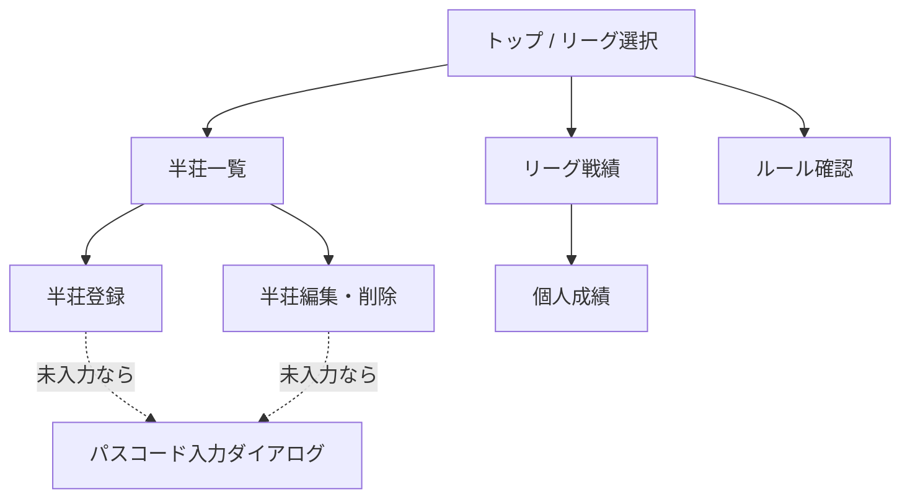

import { Aside, Steps } from '@astrojs/starlight/components';

## 画面一覧



| 画面 | 内容 | 書き込み |
|---|---|---|
| トップ | リーグ選択（1つならそのまま戦績へ） | – |
| リーグ戦績 | チーム合計pt、個人ランキング、累計pt推移グラフ | – |
| 半荘一覧 | 日付順の半荘リスト。各半荘の4人・素点・pt・順位 | – |
| 半荘登録 | 日付・4人・素点を入力して保存 | **唯一の新規登録**／パスコード必要 |
| 半荘編集・削除 | 登録済みの修正、論理削除（確認ダイアログ） | 更新／パスコード必要 |
| 個人成績 | 指標一覧＋推移グラフ | – |
| ルール確認 | 対局ルール（Markdown）＋換算設定 | – |
| パスコード入力 | 書き込み時にだけ出るダイアログ。`localStorage` に保存 | – |

<Aside type="note" title="閲覧は無認証のまま">
`GET` 系はパスコード不要。10人全員がURLを開くだけで戦績を見られる。パスコードが要るのは登録・編集・削除だけ（決定#16）。
</Aside>

## 半荘登録（コア機能）

### 入力項目

- 日付（デフォルト今日）
- 4人のメンバー（リーグ所属メンバーから選択）
- 各人の素点（100点単位、負数可）

### バリデーション

| チェック | 条件 | 理由 |
|---|---|---|
| 件数 | ちょうど4人 | – |
| メンバー重複なし | 4人がすべて異なる | – |
| **リーグ所属** | 4人とも `league_members` にその `league_id` で載っている | **外部キーでは防げない**（下記） |
| **2-2固定** | **4人がちょうど2チームにまたがり、各チーム2人ずつ** | チーム戦の公平性。3チーム以上にまたがる編成は弾く（DBは2チーム固定を強制していない） |
| 素点合計 | 4人合計 = **`start_point × 4`**（デフォルト設定なら 25,000 × 4 = 100,000） | 供託リーチ棒はトップ取りで精算済み前提。**`100000` を定数で埋め込まない**（リーグ設定依存） |
| 素点の単位 | 100の倍数 | 誤入力防止 |
| 箱下 | 負数OK | トビ終了なし・箱下精算あり |
| 日付 | `YYYY-MM-DD` の実在日付 | DB側の `CHECK` でも二重に守る（→ [日付の検証](/spec/data-model/#日付の検証)） |
| メモ | 500文字以内（省略可） | `GET /api/leagues/:id` が全半荘を1回で返す設計なので、1件の肥大が全員の取得を重くする |

<Aside type="caution" title="「リーグ所属」チェックはAPIにしか置けない">
`game_results.member_id` の外部キーは **`members(id)` が存在するか**しか見ない。`league_members` にそのリーグで載っているかは検査されないので、**別リーグのメンバーや、リーグに未所属のメンバーを含む半荘が DB に入ってしまう**（実測確認済み）。

2-2固定チェックはどのみち `league_members` を引いてチームを判定するので、**そのついでに「4人とも引けたか」を確認すれば所属チェックになる**。引けなかった人が1人でもいたら弾く。

引くときは必ず **`WHERE league_id = ?`** でスコープすること。`member_id` だけで引くと別リーグの所属行が混ざる。

**副作用**: メンバーがリーグから外れた後、その人を含む過去の半荘は `PATCH` できなくなる（所属チェックで落ちる）。10人固定なら滅多に起きないが、起きたときは**運営が `wrangler d1 execute` で直す**（決定#11と同じ扱い）。編集画面には「このメンバーは現在リーグに所属していません」と出す。チェックを緩める方向では直さない。
</Aside>

<Aside type="note" title="派生エラーは抑制する — 原因を隠さないために">
検証は表の順（件数 → 重複 → 所属 → 2-2 → 合計 → 単位 → 日付）に行い、**エラーは全部まとめて返す**（最初の1件で打ち切らない）。

ただし **2-2 と素点合計だけは、前提が崩れているときに判定しない**。

| 前提の崩れ | 抑制するもの | 抑制しないと何が起きるか |
|---|---|---|
| 4人でない | 2-2 / 素点合計 | 3人で「各チーム2人ずつ」を問うのは無意味 |
| 重複がある | 2-2 | `A(t1), A(t1), B(t1), C(t2)` が `t1:3 / t2:1` になり、**根本原因が重複なのに「チーム構成エラー」が出る** |
| 未所属がいる | 2-2 | teamId 不明の人を数えると `undefined` チームが生まれ、**本当の原因（未所属）が「チーム構成エラー」に化ける** |

抑制するのは 2-2 と素点合計の判定だけで、**件数・重複・所属のエラーはそれぞれ独立に返す**。入力係に「2-2にしてるのになぜ？」と思わせないための措置。原因が分からないエラーは、出ないのと大差ない。
</Aside>

<Aside type="caution" title="形の検査と業務ルールの検査は2段に分ける">
`validateGameInput()` は **型どおりの `GameInput` が来る前提**で書かれている。`results` が配列でなければ `.length` で例外になるし、`playedOn` が文字列でなければ正規表現が `"undefined"` を評価してしまう。

APIは JSON ボディという**信用できない入力**を受け取るので、**形の検査を業務ルールの検査より先に置く**。

| 段 | 何を見るか | 失敗時 |
|---|---|---|
| 0. 入口 | `Content-Length` が 16KB 以下か | `413` |
| 0. 入口 | JSON としてパースできるか | `400`（`{ error: 'invalid json' }`） |
| 1. 形（parse） | `results` は配列か / 各項目の `memberId` `rawScore` が **`typeof === 'number'` かつ `Number.isSafeInteger()`** か / `playedOn` は文字列か / `memo` は文字列か null か | `400`（`{ error: "..." }`） |
| 2. 業務ルール | `validateGameInput()` | `400`（`ValidationError[]` を返す） |

フロントはフォームの型が保証されているので1段目は不要。**APIだけが2段必要**。

`Content-Type` は検査しない。同一オリジンの自前フロントしか叩かないので YAGNI。
</Aside>

<Aside type="danger" title="数値は typeof で見る。% や比較に頼ると素通りする">
`rawScore` を「100の倍数か」で見るとき、**JS の暗黙変換が防衛線を全部無効にする**。実測した値:

| 送られてきた値 | `% 100` | 結果 |
|---|---|---|
| `"25000"`（文字列） | `0` | **通る** |
| `"2.5e4"`（指数表記） | `0` | **通る** |
| `"0x61a8"`（16進） | `0` | **通る** |
| `" 25000 "`（前後空白） | `0` | **通る** |
| `null` | `0` | **通る** |

`null % 100` が `0` になるのが特に危ない。合計チェックも文字列が混ざると `'0' + '25000' + ...` の連結になり、判定の意味が変わる。

**parse 段で `typeof x === 'number' && Number.isSafeInteger(x)` を `memberId` と `rawScore` の両方に要求する。** ここを緩くすると、その先の型はすべて嘘になる。DB の `STRICT` も助けにならない（数値解釈できる TEXT は無損失変換されて格納されるため → [データモデル](/spec/data-model/#postgres-からの型の読み替え)）。
</Aside>

<Aside type="caution" title="バリデーションはフロントとAPIの両方に置く">
Supabase 直アクセス時代は「アプリ側でバリデーション」の1箇所で済んだが、API層ができた以上 **同じチェックをサーバーでも通す**。フロントのチェックは入力体験のため、サーバーのチェックはデータ整合性のため、と役割が違う。共通ロジックは **`src/lib/validation.ts`** に置いて両方から呼ぶ。

`scoring.ts` の `scoreGame()` には**入力検証を入れない**。「与えられた4人を採点する」だけの責務に保ち、業務ルールの検証は `validation.ts` に集約する。例外は**関数の事前条件**（`results` がちょうど4件か）だけで、これは違反すると*例外を投げずに妥当そうな誤った pt を返す*ため `scoreGame()` 自身が `RangeError` を投げる。
</Aside>

<Aside type="tip">
保存するのは素点だけ。順位・pt はフロントで都度計算するので、登録画面でもプレビューとして計算結果を表示すると誤入力に気づきやすい。
</Aside>

### 登録の流れ

<Steps>
1. 半荘一覧 →「登録」ボタン
2. 日付を確認（デフォルト今日）
3. 4人を選択（チーム別に色分け表示、2-2でないと警告）
4. 素点を入力 → 合計が100,000になると保存ボタンが有効化
5. pt/順位のプレビューを確認して保存
6. パスコード未入力ならダイアログが出る（一度入れれば `localStorage` に残る）
</Steps>

## リーグ戦績

- **チーム合計pt** = 所属メンバーの pt 総和（半荘数の上限なし）
- **個人ランキング** = 合計pt 降順
- **累計pt推移グラフ**（Recharts の折れ線）: 横軸＝半荘の通し番号 or 日付、縦軸＝累計pt。チーム・個人を切替

<Aside type="note" title="取得は1リクエストにまとめる">
`GET /api/leagues/:id` で **リーグ設定・メンバー・チーム・全半荘の素点** を1回で返す。SQLite なので JOIN の回数を気にする必要はなく、往復回数を減らすほうが効く。以降の集計は全部フロントで行う（決定#14）。
</Aside>

## 個人成績

素点だけから算出できる指標に絞る。

| 指標 | 算出 |
|---|---|
| 合計pt | Σ pt |
| 半荘数 | 出場した半荘の数 |
| 平均pt | 合計pt / 半荘数 |
| 平均順位 | Σ 順位 / 半荘数（同点は平均順位、例: 2位タイ→2.5） |
| 1〜4着回数・率 | 各順位のカウント / 半荘数 |
| トップ率 / ラス率 | 1着率 / 4着率 |
| 最高・最低素点 | max / min(raw_score) |
| 累計pt推移 | 折れ線グラフ |

## 修正・削除

- **入力係のみ**が編集・削除できる（`X-Passcode` ヘッダ必須）
- 削除は物理削除ではなく `games.deleted_at` をセットする**論理削除**
- `DELETE` エンドポイントは実装しない
- 削除済みは一覧・集計から除外。復旧が必要になったら運営が DB で `deleted_at` を NULL に戻す

### APIの形

書き込み系エンドポイントは**3本だけ**。すべて `X-Passcode` 必須。

| メソッド | パス | 意味 |
|---|---|---|
| `POST` | `/api/games` | 半荘の新規登録（`games` 1行 + `game_results` 4行） |
| `PATCH` | `/api/games/:id` | 半荘の内容修正（**全置換**） |
| `PATCH` | `/api/games/:id/deleted` | 論理削除 |

<Aside type="caution" title="PATCH /api/games/:id は部分更新ではなく全置換">
`played_on` / `memo` / `results`（4人分）を**まとめて丸ごと差し替える**。部分更新（素点1人分だけ送る等）は受け付けない。

理由は2つ。(a) 登録時とまったく同じバリデーション（2-2固定・合計 `start_point × 4`・重複なし・4行揃っている）をそのまま再利用できる。(b) メンバーの差し替えが起きたとき、`game_results` を行単位で `UPDATE` すると `UNIQUE(game_id, member_id)` と衝突しうるし「常に4行」の保証も崩れる。

DB操作は `batch()` の中で **該当 `game_id` の `game_results` を全削除 → 4行 INSERT** の順に流す。`batch()` 全体が1トランザクションなので、途中で落ちても4行が欠けた状態は残らない。
</Aside>

```jsonc
// PATCH /api/games/12  リクエストボディ（POST /api/games と results 以外同型）
{
  "playedOn": "2026-08-26",
  "memo": null,
  "results": [
    { "memberId": 1, "rawScore": 42300 },
    { "memberId": 6, "rawScore": 28100 },
    { "memberId": 2, "rawScore": 18400 },
    { "memberId": 7, "rawScore": 11200 }
  ]
}
```

<Aside type="danger" title="PATCH の league_id はリクエストから受け取らない">
`PATCH /api/games/:id` の `league_id` は **DB の該当 `games` 行から読む**。リクエストボディに `leagueId` を含めない。

リクエスト側の申告を信じると、**リーグ所属チェックが自己申告になって意味を失う**。「リーグ2のメンバー4人 + `leagueId: 2`」を送れば所属チェックは整合してしまい、**リーグ1の半荘がリーグ2の半荘にすり替わる**。所属チェック（`league_members` を引く）の前提が「この半荘はどのリーグのものか」なので、その前提自体を書き換えられては何も守れない。

| 送られてきたもの | 扱い |
|---|---|
| `leagueId` なし | 正常。DB の値を使う |
| `leagueId` があり DB と一致 | 正常。DB の値を使う |
| **`leagueId` があり DB と不一致** | **`400`** |

**黙って無視するのは不可。** 無視すると「送ったのに効いていない」がクライアント側から見えなくなり、リーグを移せたつもりのバグが静かに残る。エラーで返して気づかせる。

**`roster` を引く `league_id` も必ず DB 由来の値**を使うこと。ボディの値で `league_members` を引いたら、経路が変わっただけで同じ穴が開く。

`POST /api/games` は新規作成なので `leagueId` を受け取ってよい。ただし**存在しない `league_id` は `404`** で明示的に弾く（外部キーで落ちるに任せず、意図したエラーとして返す）。**`PATCH` だけが危ない**。
</Aside>

| 状況 | レスポンス |
|---|---|
| 成功 | `200` |
| パスコード不一致 | `401` |
| **`WRITE_PASSCODE` 未設定** | `500`（設定ミスであって認証失敗ではない） |
| ボディが 16KB 超 | `413` |
| JSON としてパースできない | `400`（`{ error: 'invalid json' }`） |
| 形の不正（型が違う） | `400`（`{ error: "..." }`） |
| バリデーション違反 | `400`（`ValidationError[]`） |
| **`:id` が正の安全整数でない** | `404`（`abc` `-1` `1.5` `1e30` など。存在しないリソースとして扱う） |
| `id` が存在しない | `404` |
| **`deleted_at` が入っている半荘** | `404`（削除済みは編集させない。戻すのは運営のSQL） |

### 論理削除

```jsonc
// PATCH /api/games/12/deleted
{ "deleted": true }
```

`deleted: false`（復活）は **受け付けない**（`400`）。復旧は運営が `wrangler d1 execute` で `deleted_at = NULL` に戻す運用のまま（決定#11・#9）。アプリ側に復活UIを作ると「削除の確認ダイアログ」の意味が薄れるので、あえて片道にしている。

**削除済みの半荘にもう一度送った場合は `200`**（冪等）。`PATCH /api/games/:id` が削除済みに対して `404` を返すのと**あえて違えている**。二重タップやオフライン再送で `404` が出ると入力係が「消えていないのか」と混乱するため。`UPDATE ... WHERE deleted_at IS NULL` で書き、更新行数が 0 でも `200` を返す（`deleted_at` を上書きしない）。

`POST /api/games` の成功レスポンスは **`201` + `{ id }`**。登録直後に編集画面へ遷移できるようにするため。`batch()` の**末尾に `SELECT MAX(id) FROM games` を足せば同一トランザクション内で取れる**（戻り値配列の最後の要素）。

## ルール確認ページ

- 対局ルールはリポジトリ内の Markdown（変更は PR → 再デプロイ）
- ポイント換算部分（持ち点・返し点・ウマ・オカ）だけは DB の `leagues` 設定値から動的に差し込む
- 内容は [対局ルール](/spec/rules/) を参照

## 作らないもの

- ログイン画面・ユーザーアカウント（書き込みは**共通パスコード1本**のみ）
- 誰が入力したかの記録（入力係が1人なので不要）
- メンバー・リーグ・チーム・ルール設定の管理画面（→ [使い方](/spec/usage/) の DB ファイル直操作）
- 局単位の記録（和了率・放銃率など）
- チップ・ペナルティの入力
