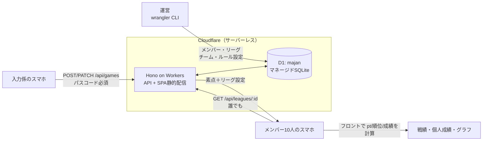

import { Aside } from '@astrojs/starlight/components';

## このアプリは何か

- **10人・5人×2チーム**の麻雀リーグ戦の戦績を管理するWebアプリ
- 集まった日に **半荘の素点を入力するだけ**で、個人pt・チーム合計・順位・成績が全部出る
- **入力は1人（入力係）、閲覧は全員**。URLを知っている身内だけが使う前提

## 決めたこと一覧

ヒアリング（2026-08-18）で一本ずつ確認して決めた内容。「なぜそうしたか」もセットで残す。
構成まわり（#11〜#17）は 2026-08-22 に Supabase → SQLite へ、2026-08-26 に Fly.io → Cloudflare Workers + D1 へ見直した。

| # | 論点 | 決定 | 理由 |
|---|---|---|---|
| 1 | 「点数計算」の意味 | **半荘終了時の素点 → リーグpt換算** | 符・翻の計算機ではなく、リーグ戦の集計が目的 |
| 2 | 換算ルールの持ち方 | **リーグ単位でDBに設定値として保持** | 後からウマ等を変えても過去分を再計算できる |
| 3 | 同点時の順位 | **ウマを折半して山分け**（トップ同点はオカも折半） | 座順（起家）の記録が不要になり入力が軽い |
| 4 | 卓組み | **各チーム2人ずつ（2-2固定）をバリデーション** | チーム間の公平性を担保。両チームの合計半荘数が常に一致する |
| 5 | データの単位 | **リーグ > 半荘（日付付き）**。「節」テーブルは作らない | シンプル優先。日付でグルーピング表示すれば十分 |
| 6 | チーム合計点 | **メンバーptの単純総和**。半荘数の上限なし | 2-2固定なのでチーム間は公平。個人間の偏りは許容 |
| 7 | 個人成績 | **基本指標＋累計pt推移グラフ** | 素点だけから全部算出できる範囲に絞る |
| 8 | 入力項目 | **日付・4人・素点のみ**。チップ・ペナルティなし | 罰符・積み棒は素点に反映済み。入力コスト最小 |
| 9 | 修正・削除 | **入力係のみ可**（確認ダイアログ）。削除は論理削除 | 書き込みが1人に集約されたので、パスコード1本で事故も荒らしも防げる |
| 10 | ルールページ | **TSX に直接書く**（Markdown を使わない） | 変更頻度が低く、どのみち変更は PR → 再デプロイ。Markdown 描画のための依存（+40〜60kB）を持つ理由が無い。換算値だけDBから差し込む |
| 11 | 管理UI | **名前と所属だけ運営メニューから変更できる**（→ [運営メニュー](/spec/features/#運営メニュー)）。換算値の変更と半荘の修復は `wrangler d1 execute` のまま | 当初は「作らない」だった（下記）。稼働後に**SQL のコピペが面倒**という理由で覆した |
| 12 | 構成 | **Vite+React SPA + Hono API（Cloudflare Workers・同一オリジン）** | SQLiteはブラウザから直接叩けないので、薄いAPI層を1枚挟む |
| 13 | ホスティング | **Cloudflare Workers + D1（マネージドSQLite）** | 永続ディスクが要らなくなり、サーバー維持もゼロ。無料枠で収まりクレカ登録も不要 |
| 14 | 計算場所 | **DBは素点のみ。pt/順位はフロントで都度計算** | ルール変更に自動追従。データ量が小さいので全件取得でOK |
| 15 | ツール | **bun / Vite+ / TS / Hono / D1 / Wrangler** | Vite+ が test（Vitest）/ lint（Oxlint）/ format を束ねる。D1ドライバはバインディングで追加依存ゼロ |
| 16 | 書き込み認証 | **共通パスコード1本**。書き込みAPIにヘッダで送る | ログイン画面もユーザーテーブルも不要。閲覧は誰でも可のまま |
| 17 | バックアップ | **D1 Time Travel（毎分自動、7日分）+ 定期 `wrangler d1 export`** | マネージドに戻ったので自動スナップショットが復活。手元にも残したい分だけSQLダンプを取る |

<Aside type="caution" title="構成の変遷: Supabase → SQLiteファイル → D1">
Supabase をやめて一度は **Fly.io + SQLiteファイル1個** の構成にしたが、(a) サーバー1台の維持、(b) バックアップの自前運用、(c) デプロイ時に永続ボリュームを壊さない配慮、の3つが自分の責任になるのが重かった。**D1 ならスキーマもSQLも素のSQLiteのまま**で、この3つがまるごとCloudflare持ちに戻る。

代わりに失うもの: (a) 「DBファイル1個を手元で握れる」感覚（`wrangler d1 export` のSQLダンプで代替）、(b) 対話的トランザクション（`batch()` で代替。→ [データモデル](/spec/data-model/#書き込みの原子性)）、(c) Cloudflareへの依存が増える（ただし中身はSQLiteなので、ダンプを持って他へ移ることは常にできる）。10人・書き込み1人の規模なら、運用の手間ゼロの方が価値が高いと判断した。
</Aside>

<Aside type="caution" title="パスコードで守れる範囲">
書き込みパスコードは **共通の合言葉1本**。漏れたら誰でも書き込めるし、誰が書いたかも追跡できない。これは「荒らし対策」ではなく **「URLを踏んだ第三者が事故で書き換えるのを防ぐ」レベルの防御**だと理解しておく。閲覧側は無防備のまま（URLが漏れたら中身は見られる）。ここが気になるようになったら、Basic認証をサーバー全体に掛けるのが一番安い。
</Aside>

## 全体像

## 未決・要確認

- Cloudflare アカウントを誰名義で作るか（無料枠・クレカ不要なので、名義と `wrangler` を叩ける人を決めるだけ）
- `wrangler d1 export` の定期実行をどうするか（月1手動 / GitHub Actions）。ダンプには個人名が入るので置き場所は要検討
- 書き込みパスコードの共有方法と、変えたくなったときの手順
- 供託リーチ棒の残りは **トップ取り** 前提（素点合計 = `start_point × 4` のチェックの根拠）。違う運用なら要変更
