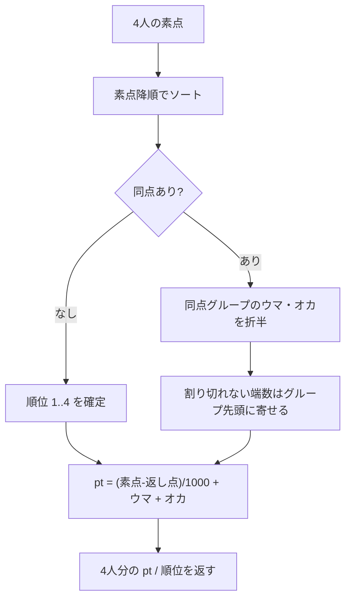

import { Aside } from '@astrojs/starlight/components';

## 方針

- DB に保存するのは **素点（raw_score）だけ**
- pt・順位はフロントで**都度計算**する（純粋関数 + Vitest でテスト）
- 計算に使うパラメータは `leagues` テーブルの設定値。後から変えても全半荘が自動で再計算される
- この関数は **フロントと Hono API の両方から呼ぶ**（登録時のサーバー再バリデーションで使う）。DBにもHTTPにも依存しない純粋関数として `src/lib/scoring.ts` に置く

## リーグ設定（デフォルト値）

| 設定 | 値 | 備考 |
|---|---|---|
| 持ち点 `start_point` | 25,000 | 素点合計チェック = 持ち点 × 4 |
| 返し点 `return_point` | 30,000 | オカあり |
| ウマ `uma` | 10-30（1-3） | 1位 +30 / 2位 +10 / 3位 -10 / 4位 -30 |
| オカ | (返し点 − 持ち点) × 4 / 1000 = **20pt** | トップに加算 |
| 小数 | 第1位まで保持 | 内部は 0.1pt 単位の整数で扱う（→ [丸めの扱い](#丸めの扱い)） |

## 換算式

```
pt = (素点 − 返し点) / 1000 + ウマ(順位) + オカ(1位のみ)
```

4人の pt 合計は必ず **0** になる（ゼロサム）。テストの不変条件として使える。

## 計算フロー



## 同点時のルール

- **ウマを折半して山分け**（起家の記録は不要）
- **トップ同点ならオカも折半**
- 順位は同順位扱い。平均順位の計算では「占める順位の平均」を使う（2位タイ → 2.5）

## 丸めの扱い

<Aside type="caution" title="単純に round すると合計が 0 にならない">
**3人がトップ同点**のとき、オカ 20pt を3等分すると 6.666... になる。各自を独立に小数第1位へ丸めると `6.7 × 3 = 20.1` となり、**pt合計が +0.1 ずれてゼロサムが壊れる**。

対策として、pt は内部で **0.1pt 単位の整数（deci-pt）** として計算し、グループへ配る合計を整数除算して**余りをグループ先頭から1ずつ配る**。これで合計は常に厳密に 0 になる。
</Aside>

### 例4: 3人がトップ同点（端数が出るケース）

1〜3位が 30,000 で同点。ウマ (30 + 10 − 10)/3 = +10、オカ 20 を3等分 → 6.666...

| 順位 | 素点 | 素点−返し | ウマ | オカ | pt |
|---|---|---|---|---|---|
| 1 (タイ) | 30,000 | ±0 | +10 | +6.7 | **+16.7** |
| 1 (タイ) | 30,000 | ±0 | +10 | +6.7 | **+16.7** |
| 1 (タイ) | 30,000 | ±0 | +10 | +6.6 | **+16.6** |
| 4 | 10,000 | −20.0 | −30 | – | **−50.0** |

合計 = 16.7 + 16.7 + 16.6 − 50.0 = **0.0** ✓

<Aside type="note" title="誰が 0.1 得するか">
素点も順位も完全に同じなので、0.1pt を誰に寄せるかに公平な根拠はない。ここでは**メンバーID昇順で先頭から**配る（決定的な順序になればよく、実運用で問題になる差ではない）。気になるなら「トップ同点は起家に近い方」等のルールを足すことになるが、それは決定#3（座順を記録しない）と衝突する。
</Aside>

## 計算例

### 例1: 同点なし

| 順位 | 素点 | 素点−返し | ウマ | オカ | pt |
|---|---|---|---|---|---|
| 1 | 42,300 | +12.3 | +30 | +20 | **+62.3** |
| 2 | 28,100 | −1.9 | +10 | – | **+8.1** |
| 3 | 18,400 | −11.6 | −10 | – | **−21.6** |
| 4 | 11,200 | −18.8 | −30 | – | **−48.8** |

合計 = 62.3 + 8.1 − 21.6 − 48.8 = **0.0** ✓

### 例2: トップ同点

1位・2位が 35,000 で同点。ウマ (30+10)/2 = 20、オカ 20/2 = 10 を両者に。

| 順位 | 素点 | 素点−返し | ウマ | オカ | pt |
|---|---|---|---|---|---|
| 1 (タイ) | 35,000 | +5.0 | +20 | +10 | **+35.0** |
| 1 (タイ) | 35,000 | +5.0 | +20 | +10 | **+35.0** |
| 3 | 20,000 | −10.0 | −10 | – | **−20.0** |
| 4 | 10,000 | −20.0 | −30 | – | **−50.0** |

合計 = 35 + 35 − 20 − 50 = **0.0** ✓

### 例3: 2位が3人同点

2〜4位が 20,000 で同点。ウマ (10 − 10 − 30)/3 = −10 を3人に。

| 順位 | 素点 | 素点−返し | ウマ | オカ | pt |
|---|---|---|---|---|---|
| 1 | 40,000 | +10.0 | +30 | +20 | **+60.0** |
| 2 (タイ) | 20,000 | −10.0 | −10 | – | **−20.0** |
| 2 (タイ) | 20,000 | −10.0 | −10 | – | **−20.0** |
| 2 (タイ) | 20,000 | −10.0 | −10 | – | **−20.0** |

合計 = 60 − 60 = **0.0** ✓

## 実装イメージ

```ts title="src/lib/scoring.ts"
export type LeagueRule = {
  startPoint: number;   // 25000
  returnPoint: number;  // 30000
  uma: [number, number, number, number]; // [30, 10, -10, -30]
};

export type Result = { memberId: number; rawScore: number };
export type Scored = Result & { rank: number; pt: number };

/** 4人の素点から順位と pt を求める。合計 pt は厳密に 0 になる。 */
export function scoreGame(results: Result[], rule: LeagueRule): Scored[] {
  // 返し点−持ち点が25の倍数でない設定でも deci-pt の整数前提を壊さないよう丸める
  const okaDeci = Math.round(((rule.returnPoint - rule.startPoint) * 4) / 100); // 20pt → 200
  // 同点内の並びを決定的にするため、素点降順 → memberId 昇順で固定
  const sorted = [...results].sort(
    (a, b) => b.rawScore - a.rawScore || a.memberId - b.memberId
  );

  const out: Scored[] = [];
  let i = 0;
  while (i < sorted.length) {
    // 同点グループ [i, j)
    let j = i;
    while (j < sorted.length && sorted[j].rawScore === sorted[i].rawScore) j++;
    const size = j - i;

    // グループに配るボーナス（ウマ＋オカ）を 0.1pt 単位の整数で
    const umaDeci = rule.uma.slice(i, j).reduce((s, u) => s + u, 0) * 10;
    const bonusDeci = umaDeci + (i === 0 ? okaDeci : 0);

    // 整数除算して、余りは先頭から 1 ずつ配る（合計が厳密に一致する）
    const each = Math.trunc(bonusDeci / size);
    let rest = bonusDeci - each * size;

    for (let k = i; k < j; k++) {
      const baseDeci = Math.round((sorted[k].rawScore - rule.returnPoint) / 100);
      const extra = rest > 0 ? 1 : rest < 0 ? -1 : 0;
      rest -= extra;
      out.push({ ...sorted[k], rank: i + 1, pt: (baseDeci + each + extra) / 10 });
    }
    i = j;
  }
  return out;
}
```

<Aside type="note">
`rank` は同点グループの先頭順位（1,1,3,4 のような形）。平均順位の計算時は `(i+1 + j) / 2` の「占める順位の平均」を別途使う。
</Aside>

## テスト観点（Vitest）

- 例1〜4 の期待値どおりになること
- **任意の入力で 4人の pt 合計が厳密に 0 になること**（3人同点トップのような端数ケースを必ず含める）
- 同じ入力に対して常に同じ結果が返ること（同点時の 0.1pt の寄せ先が安定していること）
- 素点合計が `start_point × 4` でない入力は**フロントとAPIの両方**で弾かれること（デフォルト設定なら 100,000。**定数でハードコードしない**）
- 設定を変えたとき（例: ウマ 5-10、オカなし = 返し点 25,000）に結果が追従すること
- 4人全員が同点（25,000 × 4）のとき、全員 pt = **0.0** になること（素点−返し点 −5.0 + ウマ 0 + オカ 20/4 = +5.0 → 合計 **0.0**）
