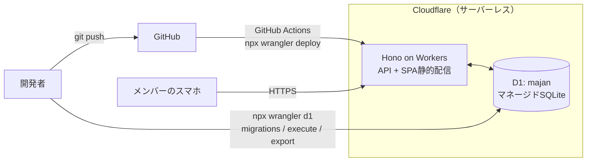

import { Aside } from '@astrojs/starlight/components';
import { FileTree } from '@astrojs/starlight/components';

## 構成図



## 採用技術

| レイヤー | 採用 | 理由 |
|---|---|---|
| フロント | **Vite+** + React + TypeScript（SPA） | Vite後継の統合ツールチェーン（ベータ）。build / test / lint / format が `vite` 1コマンドに揃う |
| UI | Tailwind + shadcn/ui | フォーム・テーブル・ダイアログがすぐ揃う |
| グラフ | Recharts | 累計pt推移の折れ線 |
| APIサーバー | **Hono**（Cloudflare Workers） | HonoはWorkersネイティブ対応。ルートは数本だけ |
| SPA配信 | Workers Static Assets | ビルド成果物（`dist/`）をWorkerと一緒にデプロイ。`/api/*` だけWorkerに流す |
| DB | **Cloudflare D1**（マネージドSQLite） | 永続ディスク不要。スキーマ・SQLは素のSQLiteのまま |
| DBドライバ | **D1バインディング**（`env.DB`） | `wrangler.jsonc` に書くだけで注入される。追加依存ゼロ |
| ホスティング | **Cloudflare 無料枠** | 5GB・読み500万行/日・書き10万行/日。10人リーグには桁違いに余裕。クレカ登録不要 |
| パッケージ管理 | bun | 速い（Workersの実行ランタイムではなく、開発ツールとして使う） |
| Lint / Format / テスト | Vite+ 同梱（Oxlint / oxfmt / Vitest） | 個別に入れる予定だったものがVite+に束ねられている |
| マイグレーション | **`wrangler d1 migrations`** | 連番SQLを順に適用。自前ランナーが不要になった |
| ローカルDB | `wrangler dev` が作る**ローカルSQLite** | `.wrangler/state/` 配下に実体ファイル。Docker不要 |

<Aside type="note" title="「永続ディスク問題」は D1 で消えた">
旧構成（SQLiteファイルを自分で持つ）は「デプロイや再起動でファイルが消えないディスク」が必須で、ホスティングが Fly.io / Render / VPS に限られていた。Workers には書き込めるファイルシステムがそもそも無いが、**D1 が SQLite を預かってくれる**ので、ファイルの置き場所・サーバー1台の維持・「2台目が立つとDBが無い」問題がまとめて消える。
</Aside>

<Aside type="danger" title="D1 のプライマリロケーションは作成時にしか決められない">
`wrangler d1 create` には `--location` でプライマリロケーションのヒントを渡せる。**メンバー全員が日本にいるので `apac`（Asia Pacific）を指定する。**

```bash
npx wrangler d1 create majan --location apac
```

D1 は書き込みを必ずプライマリで処理する（読み取りレプリカを有効にしない限り読み取りも同様）。指定しないと「作成時にコマンドを叩いた場所」から推測されるので、日本から叩けば結果的に `apac` になることが多いが、**推測に任せず明示する**。

重要なのは、**プライマリロケーションは後から変更できない**こと。変えたければ `wrangler d1 export` → 新DB作成 → インポート → `database_id` 差し替え、というやり直しになる。`wrangler d1 create` を叩く**その一回**が決定タイミングなので、忘れないこと。
</Aside>

<Aside type="caution" title="D1 の制約として知っておくこと">
- **対話的トランザクション（`BEGIN`〜`COMMIT`）が無い**。複数文の原子的な書き込みは `batch()` で行う（→ [データモデル / 書き込みの原子性](/spec/data-model/#書き込みの原子性)）
- 無料枠はDB1個あたり **500MB**・書き込み **10万行/日**。素点データは1半荘で5行なので、実運用で当たることはない
- `STRICT` テーブル・`CHECK` 制約・生成列など、SQLiteのDDLはそのまま使える
</Aside>

## SQLite の設定は D1 任せ

旧構成でサーバー起動時に自分で入れていた `PRAGMA` 群は、ほぼ不要になった。

| 旧構成の PRAGMA | D1 では |
|---|---|
| `journal_mode = WAL` | D1側で管理。触れない・触る必要もない |
| `foreign_keys = ON` | **既定で常に強制**。むしろOFFにできない |
| `busy_timeout` / `synchronous` | D1側で管理 |

<Aside type="note" title="外部キーまわりで唯一残った知識">
マイグレーション中に一時的に制約違反の状態を通したいときだけ `PRAGMA defer_foreign_keys = on` を使う（そのトランザクションの終わりまで検査を遅延）。トランザクション終了時に違反が残っていればエラーになるので、無効化ではない。
</Aside>

サーバー側はバインディング経由でDBに触る。接続の初期化コードは無い。

```ts title="server/index.ts"
import { Hono } from 'hono';

type Bindings = {
  DB: D1Database;          // wrangler.jsonc の d1_databases で注入される
  WRITE_PASSCODE: string;  // npx wrangler secret put で登録
};

const app = new Hono<{ Bindings: Bindings }>();

app.get('/api/leagues/:id', async (c) => {
  const { results } = await c.env.DB
    .prepare('SELECT * FROM games WHERE league_id = ?1 AND deleted_at IS NULL')
    .bind(c.req.param('id'))
    .all();
  return c.json(results);
});

export default app;
```

## ディレクトリ構成（案）

<FileTree>
- majan/
  - src/ フロント（Vite+）
    - lib/
      - api.ts fetch ラッパ（パスコードヘッダ付与）
      - types.ts DBの行に対応する手書き型
      - scoring.ts pt/順位計算（純粋関数）
      - stats.ts 個人成績・チーム集計
    - features/
      - games/ 半荘一覧・登録・編集
      - standings/ リーグ戦績
      - members/ 個人成績
      - rules/ ルールページ
    - components/ui/ shadcn
    - App.tsx
  - server/ APIサーバー（Hono on Workers）
    - index.ts エントリ。/api/\* のみ（静的配信は Workers Assets）
    - auth.ts 書き込みパスコード検証ミドルウェア
    - routes/
      - leagues.ts GET リーグ・メンバー・全半荘
      - games.ts POST / PATCH / 論理削除
  - migrations/ 0001_init.sql, 0002_....sql（npx wrangler d1 migrations が参照）
  - db/
    - seed.sql リーグとチーム（一発勝負・二重投入で落ちる）
    - roster.sql メンバーと所属（何度でも流せる）
  - content/
    - （content/ は作らない。対局ルールは src/features/rules/ の TSX に直接書く）
  - wrangler.jsonc Workers / D1 / Assets の定義
  - docs/
    - spec.md
  - Guidebook/ このサイト
</FileTree>

## wrangler.jsonc とシークレット

DBの接続情報は環境変数ではなく**バインディング**。`wrangler.jsonc` に書くとコード側の `env.DB` に注入される。

```jsonc title="wrangler.jsonc"
{
  "name": "majan",
  "main": "server/index.ts",
  "compatibility_date": "2026-08-01",
  "assets": {
    "directory": "./dist",
    "not_found_handling": "single-page-application",
    "run_worker_first": ["/api/*"]
  },
  "d1_databases": [
    {
      "binding": "DB",
      "database_name": "majan",
      "database_id": "<npx wrangler d1 create majan で発行されたID>"
    }
  ]
}
```

シークレットは1つだけ。

| 名前 | 用途 | 登録方法 |
|---|---|---|
| `WRITE_PASSCODE` | 書き込みAPIの共通パスコード | `wrangler secret put WRITE_PASSCODE` |

`WRITE_PASSCODE` は **ビルドに埋め込まない**（`VITE_` 接頭辞を付けない）。フロントは利用者が入力した値を `localStorage` に持ち、リクエストヘッダで送るだけにする。

APIは同一オリジン（`/api/...`）で配信するので、フロント側のAPIベースURLは環境変数にしない。旧構成にあった `DB_PATH` / `PORT` は不要になった。
