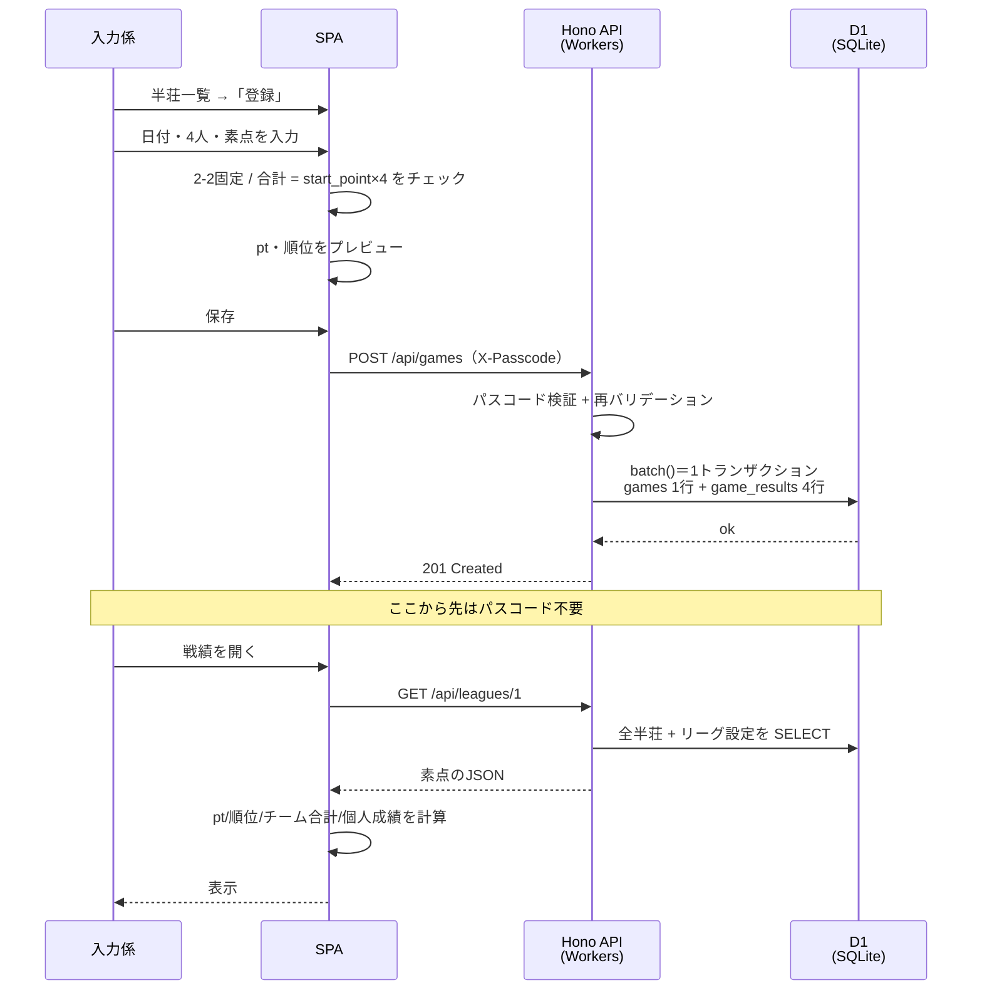

import { Aside, Steps, Tabs, TabItem } from '@astrojs/starlight/components';

## 登場人物

| 役割 | やること | 使うもの |
|---|---|---|
| **運営**（1人） | メンバー・リーグ・チーム・ルール設定の登録、バックアップ | `wrangler` CLI（`d1 execute` / `d1 export`） |
| **入力係**（1人） | 半荘の素点入力・修正 | スマホのブラウザ＋**書き込みパスコード** |
| **メンバー**（10人） | 戦績・成績の閲覧 | スマホのブラウザ（アプリURL） |

<Aside type="note">
運営と入力係は同一人物でもいい。分けているのは「Cloudflareアカウント（wrangler）でDBを直接触る権限」と「アプリから書き込む権限」が別物だから。
</Aside>

## 初回デプロイ（一番最初に1回だけ）

D1 の作成（`wrangler d1 create majan --location apac`）は済んでいる前提。**上から順に実行する。**

<Steps>
1. **本番DBにテーブルを作る**

   ```bash
   wrangler d1 migrations apply majan --remote
   ```
   `num_tables` が 0 から増えることを `wrangler d1 info majan` で確認する。

2. **制約が効いていることを1回だけ確かめる**

   ```bash
   wrangler d1 execute majan --remote --command \
     "INSERT INTO games (league_id, played_on) VALUES (1, '2026-02-30');"
   ```
   **`CHECK constraint failed` で失敗すれば正常**（2月30日は存在しないので弾かれる）。成功してしまったら制約が効いていないので調査する。

   この確認をする理由は [日付の検証](/spec/data-model/#日付の検証) にある。本番 D1 の SQLite バージョンは直接確認できない（`sqlite_version()` の呼び出しが許可されていない）ので、**挙動で確かめる**。

   あわせて、**「何を入れても落ちるだけ」ではない**ことも確かめる。

   ```bash
   wrangler d1 execute majan --remote --command \
     "INSERT INTO games (league_id, played_on) VALUES (1, '2026-02-28');"
   ```
   こちらは **`FOREIGN KEY constraint failed`**（まだリーグが無いため）。**エラーの種類が違う**ので、前者が「日付が理由で落ちた」と言い切れる。どちらも1行も書き込まれない。

3. **リーグ・チーム・メンバーを登録する**（→ 下の「リーグ立ち上げ」）

   ```bash
   wrangler d1 execute majan --remote --file=./db/seed.local.sql     # 1回だけ
   wrangler d1 execute majan --remote --file=./db/roster.local.sql   # 開幕前なら何度でも
   ```

4. **書き込みパスコードを設定する**

   ```bash
   wrangler secret put WRITE_PASSCODE
   ```
   プロンプトに入力する。**設定しないと書き込みAPIが 500 を返す**（→ [アクセス制御](/spec/data-model/#アクセス制御旧-rls)）。

5. **デプロイする**

   ```bash
   bun run build
   wrangler deploy
   ```
   出力される `https://majan.<サブドメイン>.workers.dev` がアプリのURL。

6. **動作を確認する**

   ```bash
   curl https://majan.<サブドメイン>.workers.dev/api/health          # {"ok":true}
   curl https://majan.<サブドメイン>.workers.dev/api/leagues         # リーグ一覧
   ```
   ブラウザでURLを開き、**リーグ名とメンバーが出る**ことを確認する。

7. **URLを全員に共有する。パスコードは入力係にだけ渡す。**
</Steps>

<Aside type="caution" title="順番を守る">
**2 を飛ばさない。** 制約が効いていない本番DBに実データを入れてから気づくと、**不正なデータが既に入っている状態**でスキーマを直すことになる。SQLite は `ALTER TABLE` で制約を追加できないので、テーブルの作り直しが必要になる。

**4 を 5 より先に。** 逆にすると、パスコードが未設定のまま公開される瞬間ができる。その間の書き込みは 500 で拒否されるので**データは壊れない**が、入力係が使えない時間が生まれる。
</Aside>

## リーグ立ち上げ（運営・シーズン開始時）

アプリに管理画面はないので、`wrangler` で D1 に直接投入する。**投入ファイルは2つに分かれている。**

| ファイル | 中身 | 流し直せるか |
|---|---|---|
| `db/seed.sql` | **リーグとチームの箱**（`leagues` / `teams`） | **一発勝負**。2回流すと `UNIQUE constraint failed` |
| `db/roster.sql` | **メンバーの名前と所属**（`members` / `league_members`） | **何度でも流せる**（`ON CONFLICT ... DO UPDATE`） |

<Aside type="note" title="なぜ挙動が逆なのか">
目的が違う。

- **`seed.sql` が落ちる**のは「**リーグを2つ作る事故を防ぐ**」ため。リーグは年1回しか作らないので、2回流すのはほぼ確実に間違い
- **`roster.sql` が何度でも流せる**のは「**開幕前に確定するまで直せる**」ため。名前の打ち間違い、チーム分けの変更を、同じファイルを直して流し直すだけで反映できる

**片方に合わせないこと。**
</Aside>

<Steps>
1. **実名を書くファイルを2つ作る**（どちらも `.gitignore` 済み。実名は git に残らない）

   ```bash
   cp db/seed.sql   db/seed.local.sql     # リーグ名・チーム名を変えるなら編集
   cp db/roster.sql db/roster.local.sql   # 10人の実名とチーム分けを書く
   ```

2. **テーブルを作る**（初回のみ）

   ```bash
   wrangler d1 migrations apply majan --remote
   ```

3. **リーグとチームを作る**（初回のみ）

   ```bash
   wrangler d1 execute majan --remote --file=./db/seed.local.sql
   ```

4. **メンバーと所属を投入する**（開幕前なら何度でも）

   ```bash
   wrangler d1 execute majan --remote --file=./db/roster.local.sql
   ```
   **チーム分けが決まっていなくても、仮で入れて後から直せる。**

5. **確認**

   ```bash
   wrangler d1 execute majan --remote --command \
     "SELECT t.name, COUNT(*) AS n, SUM(t.league_id <> lm.league_id) AS wrong_league \
      FROM league_members lm JOIN teams t ON t.id = lm.team_id GROUP BY t.id;"
   ```
   チームごとの人数と、`wrong_league` が 0 であることを見る。

6. `WRITE_PASSCODE` を設定し、入力係にだけ共有する
7. アプリURLを全員に共有
</Steps>

<Aside type="danger" title="開幕後に roster を流し直さないこと">
**半荘を1つでも登録した後に所属を変えると、過去の pt も新しいチームに移る。**

チーム合計ptは「**現在の所属メンバーの総和**」で計算しており（決定#6）、**過去の所属を記録していない**。

```
山田がチームAで +100pt 稼ぐ → チームBへ移動 → その +100pt はチームBの合計になる
```

**開幕前に確定させる前提の設計。** どうしても途中で変える必要が出たら、**過去の所属を記録する設計**（`game_results` に `team_id` を持つ等）への変更が要る。マイグレーションの追加になるので相談すること。
</Aside>

<Aside type="caution" title="実名は .local.sql に書く。テンプレート側は編集しない">
`db/seed.sql` と `db/roster.sql` は **プレースホルダ名（山田・佐藤…）のテンプレート**で、リポジトリにコミットされている（**public リポジトリ**）。**ここに実名を書いてはいけない。**

`db/seed.local.sql` と `db/roster.local.sql` は `.gitignore` 済みなので、**メンバー10人の実名が git 履歴に残らない**。リポジトリや Cloudflare アカウントの管理が将来変わっても、身内の実名が付いて回ることがない。

流し込むのは常に `.local.sql` の方。
</Aside>

```sql title="db/roster.local.sql（実名とチーム分けを書く。何度でも流せる）"
INSERT INTO members (id, name) VALUES
  (1,'実名1'), (2,'実名2'), (3,'実名3'), (4,'実名4'), (5,'実名5'),
  (6,'実名6'), (7,'実名7'), (8,'実名8'), (9,'実名9'), (10,'実名10')
ON CONFLICT(id) DO UPDATE SET name = excluded.name;

INSERT INTO league_members (league_id, member_id, team_id) VALUES
  (1,1,1), (1,2,1), (1,3,1), (1,4,1), (1,5,1),   -- チームA
  (1,6,2), (1,7,2), (1,8,2), (1,9,2), (1,10,2)   -- チームB
ON CONFLICT(league_id, member_id) DO UPDATE SET team_id = excluded.team_id;
```

ローカルで試すときは `--remote` を `--local` に変えるだけ。

## 日々の流れ



<Steps>
1. 半荘が終わったら**入力係**がスマホでアプリを開く
2. 「登録」→ 日付（デフォルト今日）・4人・素点を入力
3. 各チーム2人ずつ / 合計が持ち点×4（デフォルト100,000）になっていれば保存できる
4. 初回だけパスコードを入力（以降は `localStorage` に保存されて聞かれない）
5. 他のメンバーは戦績ページを開くだけでチーム合計・ランキングを確認できる
</Steps>

<Aside type="tip" title="供託リーチ棒">
半荘終了時に残った供託リーチ棒はトップが取る前提。合計が持ち点×4（デフォルト 100,000）にならない時はここを確認。
</Aside>

<Aside type="note" title="seed をやり直すときは全テーブルを消してから">
`db/seed.local.sql` は**二重投入で落ちる**（`UNIQUE constraint failed`）。これは「運営が誤って2回流しても壊れない」ための設計（→ [データモデル](/spec/data-model/)）。

そのため、**一部のテーブルだけ消して流し直すことはできない**。`leagues` だけ消して再投入しようとすると `members.id` の重複で落ちる。

やり直すなら全部消す。

```bash
wrangler d1 execute majan --local --command \
  "DELETE FROM game_results; DELETE FROM games; DELETE FROM league_members; DELETE FROM teams; DELETE FROM members; DELETE FROM leagues;"
```

ローカルなら DB ごと作り直す方が確実。

```bash
rm -rf .wrangler/state/v3/d1
wrangler d1 migrations apply majan --local
wrangler d1 execute majan --local --file=./db/seed.local.sql
```
</Aside>

## メンバー・チームを変更したいとき

**開幕前なら何度でも変えられる。** 半荘を登録した後は注意（下の警告）。

やり方は2つ。**Cloudflare のダッシュボードが一番手軽**。

<Tabs>
  <TabItem label="ダッシュボード（おすすめ）">
**Workers & Pages → D1 → majan → Console** で SQL を直接打てる。テーブルの中身も見えるので、`member_id` を調べながら作業できる。

まず現状を見る:
```sql
SELECT m.id, m.name, t.name AS team
FROM league_members lm
JOIN members m ON m.id = lm.member_id
JOIN teams   t ON t.id = lm.team_id
WHERE lm.league_id = 1
ORDER BY t.id, m.id;
```
  </TabItem>
  <TabItem label="コマンド">
```bash
wrangler d1 execute majan --remote --command "<SQL>"
```
複数文を `;` で区切って一度に流せる。
  </TabItem>
</Tabs>

### 名前を変える（打ち間違いの訂正など）

```sql
UPDATE members SET name = '新しい名前' WHERE id = 3;
```
**過去の半荘の記録はそのまま**（`game_results` は `member_id` で紐づいているので、名前を変えても成績は保たれる）。

### チームを変える

```sql
-- 1人だけ
UPDATE league_members SET team_id = 2 WHERE league_id = 1 AND member_id = 3;

-- まとめて入れ替え
UPDATE league_members SET team_id = 2 WHERE league_id = 1 AND member_id IN (1,3,5);
UPDATE league_members SET team_id = 1 WHERE league_id = 1 AND member_id IN (6,8,10);
```

### メンバーを入れ替える（人を差し替える）

**新しい人を追加**して、**古い人の所属を外す**。

```sql
-- 新しい人を登録（id は使っていない番号。11 以降）
INSERT INTO members (id, name) VALUES (11, '新メンバー');

-- リーグに所属させる（team_id は 1 か 2）
INSERT INTO league_members (league_id, member_id, team_id) VALUES (1, 11, 1);

-- 抜ける人の所属を外す
DELETE FROM league_members WHERE league_id = 1 AND member_id = 5;
```

<Aside type="danger" title="半荘に出たことのある人の所属は外さない">
**`members` の行は消さない。`league_members` の行も、その人が半荘に出たことがあるなら消さない。**

消すと2つ壊れる（→ [名簿から外れたメンバー](/spec/features/)）。

| 何が | どうなる |
|---|---|
| その人を含む過去の半荘 | **編集できなくなる**（所属チェックで落ちる） |
| チーム合計pt | **両チームの和が 0 にならなくなる**（その人のptがどちらにも入らない） |

アプリは壊れず、個人成績も見られる（「リーグ名簿にありません」と注記が出る）が、**チーム合計が釣り合わなくなる**。

**まだ半荘に出ていない人なら、外して問題ない。**
</Aside>

### 変更後に必ず確認する

```sql
SELECT t.name AS team, COUNT(*) AS n, SUM(t.league_id <> lm.league_id) AS wrong_league
FROM league_members lm JOIN teams t ON t.id = lm.team_id
WHERE lm.league_id = 1 GROUP BY t.id;
```
**各チームの人数**と、**`wrong_league` が 0** であることを見る。

<Aside type="caution" title="開幕後にチームを変えると、過去の pt も移動する">
チーム合計ptは「**現在の所属メンバーの総和**」で計算しており、**過去の所属を記録していない**（決定#6）。

```
山田がチームAで +100pt 稼ぐ → チームBへ移動 → その +100pt はチームBの合計になる
```

**開幕前に確定させる前提の設計。** 途中で変える必要が出たら、`game_results` に `team_id` を持つ設計変更が要る（マイグレーション追加）。

**名前の変更は安全**（過去の記録に影響しない）。危ないのは**所属の変更**だけ。
</Aside>

### `roster.local.sql` との関係
DBを直接変更したら、**`db/roster.local.sql` も同じ内容に直しておく**とよい。放置すると、後でうっかり流し直したときに**古い内容に戻る**。

「もう `roster.local.sql` は流さない」と決めるなら、そのままでも問題ない。

## 間違えたとき

- 半荘一覧から該当行を開いて **編集** で素点を直す（パスコード必要）
- 二重登録したら **削除**（確認ダイアログ → 論理削除）
- 消しすぎたら運営がDBで戻せる

```bash
wrangler d1 execute majan --remote --command "UPDATE games SET deleted_at = NULL WHERE id = 42;"
```

## バックアップ（運営・ほぼ自動）

日常のバックアップは D1 の **Time Travel** が勝手にやってくれる（毎分スナップショット・無料枠で7日分）。運営がやるのは、7日より古い状態も残したい分の**月1回程度の export** だけ。

```bash
# 手元にSQLダンプを落とす（月1目安）
wrangler d1 export majan --remote --output=./backups/majan-2026-08-26.sql
```

リストアは2段構え。

```bash
# 直近7日以内 → Time Travel で巻き戻す
wrangler d1 time-travel info majan
wrangler d1 time-travel restore majan --timestamp=2026-08-25T13:00:00Z

# それより古い → export しておいたSQLを流し直す
wrangler d1 execute majan --remote --file=./backups/majan-2026-08-26.sql
```

<Aside type="note" title="ダンプはローカル再現にも使える">
`wrangler d1 export` のSQLをローカルの `sqlite3` に流せば、本番同等のDBを手元で再現できる。動作確認やスキーマ変更のリハーサルに便利。
</Aside>

## ルール変更したいとき

- ウマ・オカなど換算値 → 運営が `leagues` の設定値を更新するだけ。**過去分も自動で再計算**される

```bash
wrangler d1 execute majan --remote --command "UPDATE leagues SET uma_1st = 20, uma_4th = -20 WHERE id = 1;"
```

- 対局ルールの文言 → **`src/features/rules/RulesPage.tsx`** を編集して push（再デプロイ）。Markdown は使わない（決定#10）

## パスコードを変えたいとき

```bash
wrangler secret put WRITE_PASSCODE   # プロンプトで新しい値を入力。新バージョンが即デプロイされて反映
```

入力係の端末では次の書き込み時に 401 が返るので、新しいパスコードを入れ直してもらう。

<Aside type="danger" title="半荘に出たことのあるメンバーを league_members から消さない">
誰かがリーグを抜けても、**`league_members` の行は消さない**。出場しなくなるだけにする。

消すと2つ壊れる。

| 何が | どうなる |
|---|---|
| その人を含む過去の半荘 | **編集できなくなる**（所属チェックで落ちる。決定#9 の修正機能が使えない） |
| チーム合計pt | **両チームの和が 0 にならなくなる**（その人のptがどちらにも入らないため） |

DBはこれを止められない（`game_results` に `league_id` が無いので外部キーを張れない）。**運用で守るしかない。**

すでに消してしまった場合は、行を戻せば直る。

```bash
wrangler d1 execute majan --remote --command \
  "INSERT INTO league_members (league_id, member_id, team_id) VALUES (1, 5, 1);"
```
</Aside>

## 翌シーズン

- `leagues` に新しい行を作り、`teams` / `league_members` を組み直す
- `members` はそのまま。過去リーグのデータは残る（アプリのトップでリーグ切替）

```sql
INSERT INTO leagues (id, name) VALUES (2, '2027 春リーグ');  -- 換算値は DEFAULT のまま
INSERT INTO teams (id, league_id, name) VALUES (3, 2, 'チームA'), (4, 2, 'チームB');
INSERT INTO league_members (league_id, member_id, team_id) VALUES (2, 1, 3), (2, 2, 4);
-- ... 5人ずつ
```
