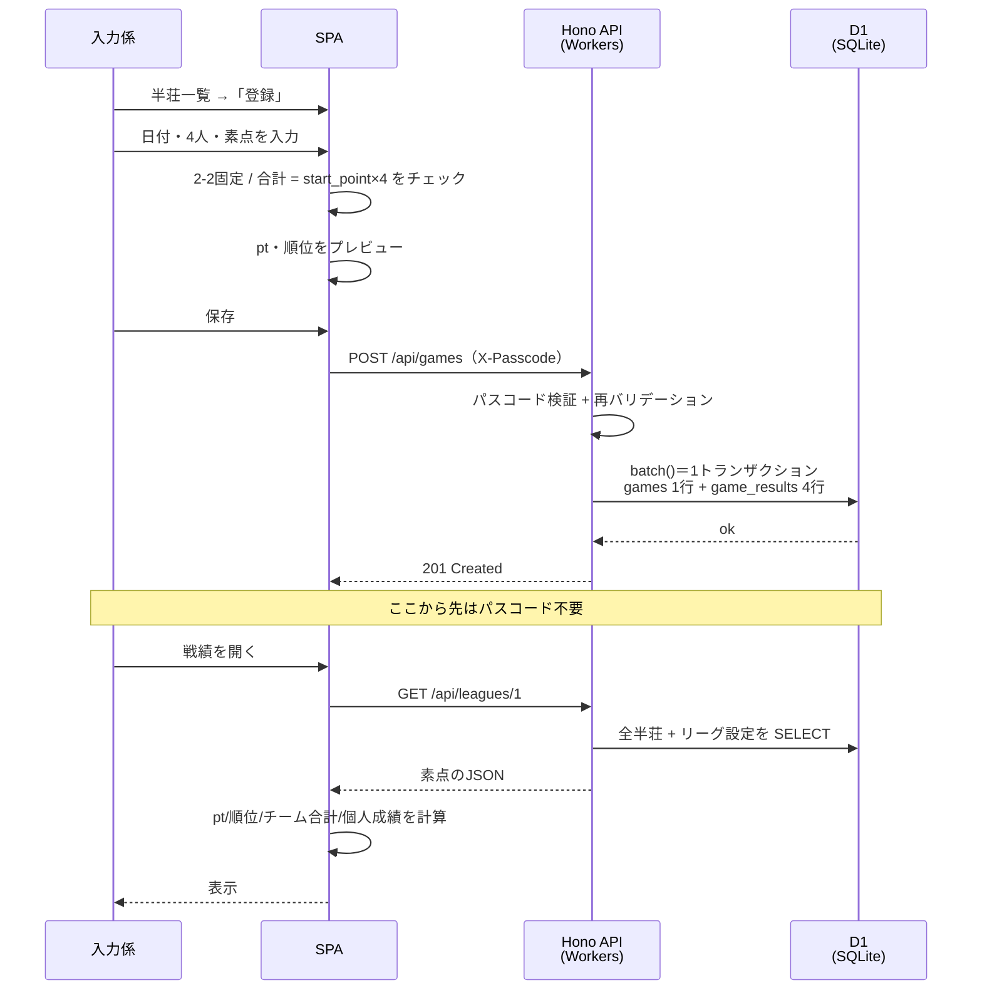

import { Aside, Steps, Tabs, TabItem } from '@astrojs/starlight/components';

## 登場人物

| 役割 | やること | 使うもの |
|---|---|---|
| **運営**（1人） | メンバー・リーグ・チーム・ルール設定の登録、バックアップ | `wrangler` CLI（`d1 execute` / `d1 export`） |
| **入力係**（1人） | 半荘の素点入力・修正 | スマホのブラウザ＋**書き込みパスコード** |
| **メンバー**（10人） | 戦績・成績の閲覧 | スマホのブラウザ（アプリURL） |

<Aside type="note">
運営と入力係は同一人物でもいい。分けているのは「Cloudflareアカウント（wrangler）でDBを直接触る権限」と「アプリから書き込む権限」が別物だから。
</Aside>

## リーグ立ち上げ（運営・シーズン開始時に1回）

アプリに管理画面はないので、`wrangler` で D1 に直接投入する。

<Steps>
1. `db/seed.sql` を編集して10人の名前・チーム分けを書く
2. マイグレーションを適用（`wrangler d1 migrations apply majan --remote`）してテーブルを作る
3. `seed.sql` を流し込む
4. `WRITE_PASSCODE` を設定し、入力係にだけ共有する
5. アプリURLを全員に共有
</Steps>

<Tabs>
  <TabItem label="seed.sql">
```sql title="db/seed.sql"
INSERT INTO leagues (id, name, start_point, return_point, uma_1st, uma_2nd, uma_3rd, uma_4th)
VALUES (1, '2026 秋リーグ', 25000, 30000, 30, 10, -10, -30);

INSERT INTO teams (id, league_id, name) VALUES
  (1, 1, 'チームA'),
  (2, 1, 'チームB');

INSERT INTO members (id, name) VALUES
  (1,'山田'), (2,'佐藤'), (3,'鈴木'), (4,'田中'), (5,'高橋'),
  (6,'伊藤'), (7,'渡辺'), (8,'中村'), (9,'小林'), (10,'加藤');

INSERT INTO league_members (league_id, member_id, team_id) VALUES
  (1,1,1), (1,2,1), (1,3,1), (1,4,1), (1,5,1),   -- チームA
  (1,6,2), (1,7,2), (1,8,2), (1,9,2), (1,10,2);  -- チームB
```
  </TabItem>
  <TabItem label="本番へ流す">
```bash
# マイグレーション
wrangler d1 migrations apply majan --remote

# seed を流し込む
wrangler d1 execute majan --remote --file=./db/seed.sql

# 確認
wrangler d1 execute majan --remote --command "SELECT * FROM league_members;"

# 書き込みパスコードを設定（プロンプトで値を入力）
wrangler secret put WRITE_PASSCODE
```
  </TabItem>
  <TabItem label="ローカルで確認">
```bash
wrangler d1 migrations apply majan --local   # .wrangler/state/ 配下にSQLiteが作られる
wrangler d1 execute majan --local --file=./db/seed.sql
bun run dev                                  # Vite+ dev + wrangler dev
```

GUIで見たいときは、`.wrangler/state/v3/d1/` 配下にあるSQLite実体ファイルを TablePlus / DB Browser for SQLite で開くだけ。
  </TabItem>
</Tabs>

## 日々の流れ



<Steps>
1. 半荘が終わったら**入力係**がスマホでアプリを開く
2. 「登録」→ 日付（デフォルト今日）・4人・素点を入力
3. 各チーム2人ずつ / 合計が持ち点×4（デフォルト100,000）になっていれば保存できる
4. 初回だけパスコードを入力（以降は `localStorage` に保存されて聞かれない）
5. 他のメンバーは戦績ページを開くだけでチーム合計・ランキングを確認できる
</Steps>

<Aside type="tip" title="供託リーチ棒">
半荘終了時に残った供託リーチ棒はトップが取る前提。合計が持ち点×4（デフォルト 100,000）にならない時はここを確認。
</Aside>

## 間違えたとき

- 半荘一覧から該当行を開いて **編集** で素点を直す（パスコード必要）
- 二重登録したら **削除**（確認ダイアログ → 論理削除）
- 消しすぎたら運営がDBで戻せる

```bash
wrangler d1 execute majan --remote --command "UPDATE games SET deleted_at = NULL WHERE id = 42;"
```

## バックアップ（運営・ほぼ自動）

日常のバックアップは D1 の **Time Travel** が勝手にやってくれる（毎分スナップショット・無料枠で7日分）。運営がやるのは、7日より古い状態も残したい分の**月1回程度の export** だけ。

```bash
# 手元にSQLダンプを落とす（月1目安）
wrangler d1 export majan --remote --output=./backups/majan-2026-08-26.sql
```

リストアは2段構え。

```bash
# 直近7日以内 → Time Travel で巻き戻す
wrangler d1 time-travel info majan
wrangler d1 time-travel restore majan --timestamp=2026-08-25T13:00:00Z

# それより古い → export しておいたSQLを流し直す
wrangler d1 execute majan --remote --file=./backups/majan-2026-08-26.sql
```

<Aside type="note" title="ダンプはローカル再現にも使える">
`wrangler d1 export` のSQLをローカルの `sqlite3` に流せば、本番同等のDBを手元で再現できる。動作確認やスキーマ変更のリハーサルに便利。
</Aside>

## ルール変更したいとき

- ウマ・オカなど換算値 → 運営が `leagues` の設定値を更新するだけ。**過去分も自動で再計算**される

```bash
wrangler d1 execute majan --remote --command "UPDATE leagues SET uma_1st = 20, uma_4th = -20 WHERE id = 1;"
```

- 対局ルールの文言 → リポジトリの `content/rules.md` を編集して push（再デプロイ）

## パスコードを変えたいとき

```bash
wrangler secret put WRITE_PASSCODE   # プロンプトで新しい値を入力。新バージョンが即デプロイされて反映
```

入力係の端末では次の書き込み時に 401 が返るので、新しいパスコードを入れ直してもらう。

## 翌シーズン

- `leagues` に新しい行を作り、`teams` / `league_members` を組み直す
- `members` はそのまま。過去リーグのデータは残る（アプリのトップでリーグ切替）

```sql
INSERT INTO leagues (id, name) VALUES (2, '2027 春リーグ');  -- 換算値は DEFAULT のまま
INSERT INTO teams (id, league_id, name) VALUES (3, 2, 'チームA'), (4, 2, 'チームB');
INSERT INTO league_members (league_id, member_id, team_id) VALUES (2, 1, 3), (2, 2, 4);
-- ... 5人ずつ
```
